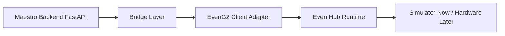

# Proposed Maestro to EvenG2 Architecture (Phase 1)

Goal: connect the existing Maestro backend and APIs to the EvenG2 client with minimal backend disruption and a thin-client contract.

## Design Constraints

- Keep business logic in Maestro backend.
- Keep G2 client stateless and presentation-focused.
- Reuse existing Maestro REST APIs as source of truth.
- Add only minimal bridging surface needed for near-real-time updates.

## High-Level Model



## Bridge Layer Responsibilities

- Poll existing Maestro endpoints for incremental updates in the first cut.
- Normalize backend responses into compact client events.
- Maintain connection state and reconnection strategy.
- Translate client outbound messages into existing Maestro endpoint calls.

## Why Poll-First, Upgrade-Ready

Current Maestro backend does not yet expose websocket endpoints, but existing APIs are functional today.

Phase 1 bridge strategy:
- Use existing endpoints immediately.
- Implement a transport abstraction in the EvenG2 client.
- Start with HTTP polling transport.
- Upgrade to websocket transport later without rewriting UI/components.

## Proposed Event Contract

Inbound events to client:
- `maestro.connection_status`
- `maestro.notification`
- `maestro.workflow_update`
- `maestro.approval_request`
- `maestro.chat_message`

Outbound events from client:
- `client.chat_message`
- `client.voice_transcript`
- `client.approval_action`
- `client.ack`

## Transport Adapter Interface (Client)

```ts
interface MaestroTransport {
  connect(): Promise<void>
  disconnect(): Promise<void>
  send(event: ClientEvent): Promise<void>
  onEvent(handler: (event: MaestroEvent) => void): () => void
}
```

Implementations:
- `MockTransport` (current simulator-first prototype)
- `HttpPollingTransport` (first real Maestro integration)
- `WebSocketTransport` (future upgrade once backend supports it)

## Integration Mapping (Initial)

Candidate existing Maestro endpoints to leverage:
- `POST /maestro/respond` for user text messages.
- `POST /maestro/plan` and `POST /maestro/plans/{plan_id}/run` for workflow-oriented updates.
- `POST /maestro/tool-calls/{tool_call_id}/approve|reject` for approval actions.

Bridge can wrap these calls and publish reduced event envelopes to the G2 client.

## Voice Path (Simulator First)

- Phase 1: client emits `client.voice_transcript` from mock voice capture button.
- Bridge forwards transcript as text context to existing Maestro chat flow.
- Later: swap mock transcript source with real Even SDK audio pipeline and speech transcription service.

## Recommended Implementation Sequence

1. Keep current mock UI and event timeline in place.
2. Add `HttpPollingTransport` using existing Maestro endpoints.
3. Add minimal backend-friendly event mapping document and fixtures.
4. Validate reconnect behavior and message ordering in simulator.
5. Decide whether backend websocket endpoint is still needed after poll-first validation.

## Open Decisions

- Poll cadence and incremental cursor strategy.
- Canonical ID used for session and conversation continuity.
- Whether approval actions should be exposed as dedicated cards on G2 first, or folded into message actions.
- Whether to include voice-transcript confidence metadata in initial payloads.
