Maestro Architecture 
High level arch model:

Current architecture decisions:
- C Suite workflows are Maestro-level workflows, not a separate domain. They begin with user input or scheduled Maestro activity and require cross-domain coordination, synthesis, and task delegation.
- Maestro-level session memory should exist for direct conversations with Maestro, similar to ChatGPT conversation memory.
- Maestro Development is its own domain and can edit the Maestro codebase from the beginning. The intended long-term loop is: Maestro introspects or receives feedback, the Maestro Development domain turns that into implementation work, and Codex executes changes through GitHub issues/branches/PRs.
- Postgres is the default database from the start because memory, provenance, and structured retrieval are core product concerns.
- The first end-to-end workflow after skeleton, phone access, and memory foundations is Daily Standup. It can start thin, but it should force the architecture to task subordinate domain agents, collect their reports, and synthesize cross-domain recommendations.

Memory design 
Each domain has its own memory store and agents within that domain can ONLY access that domain’s memory. Maestro level can access all memories from the domains as well as its own memory.

Layer 1: Session memory - each domain will have session memory that records logs and memory from each agent's individual sessions, including what Maestro tasked it with. Preferably this uses a workflow/task key so we can link sessions that originated from the same user input. Session memory at the Maestro level looks like individual conversation memory, similar to ChatGPT.

Layer 2: Agent Memory - each agent has persisted memory that transcends individual sessions. This includes memory specific to that agents role (ie the CTO Agent doesn’t need to know the CGO agent’s memory inherently)

Layer 3: Domain Memory - This is all memory that is needed to be known by all agents and future agents working in that domain, but does not need to be known by other domains

Layer 4: Maestro Global Memory - important info about me, my motivations, and my preferences that is not needed by domain-level workers. This is organizational-level knowledge, not a log of all agent reports. Reports live at lower layers and can be retrieved by Maestro as necessary.

Memory write policy:
- Agents can write logs.
- Agents can create artifacts.
- Agents can propose memory.
- The Memory Curator is the only component that writes canonical memory.
- Low-impact durable memories may be written automatically by the curator.
- Very high-impact memories require user approval before becoming canonical memory.
- Raw logs and artifacts are always retained for provenance, auditability, and future re-processing.
- Every answer or decision Maestro returns should eventually be explainable by pointing back to memory items, reports, artifacts, tool calls, or external sources.

Memory Service
│
├── Global Memory
│
├── Personal Domain
│   ├── Domain Memory
│   ├── Sessions
│   └── Agent Logs
│
├── Maestro Development Domain
│   ├── Domain Memory
│   ├── Sessions
│   └── Agent Logs
├── Praxis Domain
│   ├── Domain Memory
│   ├── Sessions
│   └── Agent Logs
│
├── Ophi Domain
│   ├── Domain Memory
│   ├── Sessions
│   └── Agent Logs
│
├── USMA Domain
    ├── Domain Memory
    ├── Sessions
    └── Agent Logs
├── Personal IRAD Projects Domain
    ├── Domain Memory
    ├── Sessions
    └── Agent Logs
└── L3 Domain
    ├── Domain Memory
    ├── Sessions
    └── Agent Logs

Execution flow for every Maestro or agent action: 

Task
   ↓
Memory Retrieval
   ↓
Relevant Context Bundle
   ↓
LLM
   ↓
Output
   ↓
Raw Log / Artifact Storage
   ↓
Memory Proposal
   ↓
Memory Curator Review
   ↓
Canonical Memory Write or Approval Request

By owning all of this memory we want Maestro to be able to provide provenance on everything it returns: explain why it knows something or made a recommendation and point to real memory, reports, artifacts, tool calls, or discovered knowledge.
High Level Arch 

```mermaid
flowchart TB
    User[User: Web / Phone / Voice / CLI] --> UI[Maestro Web App]

    UI --> Maestro[Maestro Orchestrator<br/>Chief of Staff Layer]

    Maestro --> Router[Task Router]
    Maestro --> Synth[Synthesis / Reporting Engine]
    Maestro --> GlobalMem[(Global Memory<br/>Cross-domain context)]
    Maestro --> CWorkflow[C Suite Workflows<br/>Daily Standup / Ideas / Status / Learning]

    Router --> Personal[Personal Enclave]
    Router --> MaestroDev[Maestro Development Enclave]
    Router --> Praxis[Praxis Enclave]
    Router --> Ophi[Ophi Enclave]
    Router --> USMA[USMA Enclave]
    Router --> IRAD[Personal IRAD Projects Enclave]
    Router --> L3[L3 Enclave]

    Personal --> PMem[(Personal Domain Memory)]
    MaestroDev --> MDMem[(Maestro Development Memory)]
    Praxis --> PrMem[(Praxis Domain Memory)]
    Ophi --> OMem[(Ophi Domain Memory)]
    USMA --> UMem[(USMA Domain Memory)]
    IRAD --> IMem[(IRAD Domain Memory)]
    L3 --> L3Mem[(L3 Domain Memory)]

    Personal --> PAgents[Email / Calendar Agents]
    MaestroDev --> MDAgents[Introspection / CTO / Codex Agents]
    Praxis --> PrAgents[CTO / CGO / Market Agents]
    Ophi --> OAgents[CTO / Research Agents]
    USMA --> UAgents[Teaching / Admin Agents]
    IRAD --> IAgents[Project / Build Plan Agents]
    L3 --> L3Agents[L3 Agents]

    PAgents --> PTools[Gmail / Calendar APIs]
    MDAgents --> MDTools[GitHub / Codex / Web Search]
    PrAgents --> PrTools[GitHub / ClickUp / Web Search]
    OAgents --> OTools[GitHub / Research APIs / Web Search]
    UAgents --> UTools[Calendar / Docs / Teaching Materials]
    IAgents --> ITools[GitHub / Codex / Research APIs]
    L3Agents --> L3Tools[Configured L3 Tools]

    PAgents --> PLog[(Agent Memory / Logs)]
    MDAgents --> MDLog[(Agent Memory / Logs)]
    PrAgents --> PrLog[(Agent Memory / Logs)]
    OAgents --> OLog[(Agent Memory / Logs)]
    UAgents --> ULog[(Agent Memory / Logs)]
    IAgents --> ILog[(Agent Memory / Logs)]
    L3Agents --> L3Log[(Agent Memory / Logs)]

    PAgents --> Synth
    MDAgents --> Synth
    PrAgents --> Synth
    OAgents --> Synth
    UAgents --> Synth
    IAgents --> Synth
    L3Agents --> Synth

    Synth --> Curator[Memory Curator]
    Curator --> GlobalMem
    Curator --> PMem
    Curator --> MDMem
    Curator --> PrMem
    Curator --> OMem
    Curator --> UMem
    Curator --> IMem
    Curator --> L3Mem

    Synth --> Reports[(Reports / Briefs / Updates)]
    Reports --> UI

    subgraph LocalHost[Mac / Mini PC Host]
        UI
        Maestro
        Router
        Synth
        Curator
        GlobalMem
        Reports
        Personal
        MaestroDev
        Praxis
        Ophi
        USMA
        IRAD
        L3
    end

    UI -. remote access .-> Phone[Phone via LAN / Tailscale / Tunnel]

```

Memory Management
We need to build a memory curator agent to ingest all of the knowledge and artifacts that I currently have, extract knowledge, generate canonical knowledge, and store it properly in the memory system. 

Initial seeding 
1. Build raw knowledge packages 
2. Feed agent chat exports, decks, docs, readouts, plans, and notes to generate entities, facts, decisions, projects, relationships, preferences, standing instructions, and source-linked summaries.
3. Store raw packages as artifacts so the seed process is reproducible.
4. Let the Memory Curator generate canonical memories from seed packages.
5. Auto-approve low-risk seed memory and request approval for very high-impact identity, strategy, credential, or long-lived preference memories.

ON every interaction:

Agent produces output
        ↓
Raw output is stored as an artifact/log
        ↓
Memory Curator reviews it
        ↓
Curator extracts durable memory chunks
        ↓
Memory Service writes approved structured memory

This way we have a living agent in the system to manage and curate memory. We will still save raw logs and artifacts, but retrieval should favor organized canonical memory and provenance-linked reports while still allowing raw artifacts to be reprocessed later.

Memory must be built early. The system should support seed packages before the first sophisticated workflow, because Daily Standup and future workflow quality will depend on durable context.

Maestro Experience  
MVP
web app accessible from phone:
- page 1: chat interface and list of most recent reports from Maestro. Three bar menu in the corner to open side bar. Chat interface is to talk to main Maestro interface (this API end point can later be wired to other input modalities.)
- Side bar: List of domains and a setting option. Setting lets me set all my keys and stuff. Opening each domain will bring you to the domain page
- Domain specific page: list of active agents - clicking on an agent will allow you to view and edit the agent’s role. List of tools configured for this domain. Clicking on the tool will open up the credentials and a short description so I can edit the credentials if need be. Plus button to add new agent which will open agent design panel (same as page that open to edit one) 
- Agent design panel: agent name, system prompt, select tools to give access to, set frequency of run if recurring.

I need to be able to open Maestro on my phone as early in development as possible so when we are building and adding new features I can run tests and provide feedback on the move. 

MVP build order:
1. Repo foundation and local app skeleton.
2. Phone-accessible web app over LAN/Tailscale.
3. Postgres persistence and core domain/agent/task/report models.
4. Memory service, memory proposal flow, and Memory Curator.
5. Seed package ingestion for existing docs, artifacts, and old AI conversations.
6. Thin Daily Standup workflow that tasks domain agents, collects reports, and synthesizes cross-domain recommendations.

Maestro Workflows 

C Suite 
These are Maestro-level workflows, not a separate domain. They are the control plane where things are aggregated or disseminated between domains. This is the primary set of workflows that I will directly interact with.

1.1 Daily Standup Meeting
Each morning I would like to receive a report that contains my aggregated schedule from the various domains, a list of to dos, and recommended tasks. I want to be able to interact with Maestro about this and have it make adjustments or updates. This is also my opportunity to provide updates in a single conversation on progress across domains which Maestro will parse through and send down to update the specific domains' memory. This will require calendar and to-do reporting from each domain plus updates on completion down to each domain. Maestro level handles recommending priorities and providing alternative options, for example: “you’ve had this paper review on your calendar for weeks from USMA, but it will take 2 hours and executing this follow-up meeting with this guy from your Praxis CRM that is going stale is a better use of this time block.”

Daily Standup MVP shape:
- Maestro starts or receives a standup request.
- Maestro asks each enabled domain for a thin domain brief.
- Each domain agent returns schedule, active tasks, blockers, recommended work, and decisions needed.
- Maestro synthesizes one cross-domain report with recommended priorities and tradeoffs.
- User can respond with updates or decisions in the same conversation.
- Maestro turns those updates into domain-specific tasks, memory proposals, or issue/backlog updates.

1.2 Hey I have an Idea 
At any point in the day I want to be able to brain dump a rough idea to Maestro. Having knowledge across all of my domains it can iterate with me on this idea (or not if I don’t have time ) then share the outcome of this idea down to the requisite domain to update to dos / docs / issues etc as appropriate. I can then come back and restart brain storming on  this   (Similar to how I jump into different convos with chat gpt in the app) and pick back up, which will result in updating whatever is necessary down at the domain level.

1.3 Status Report 
In a snapshot report let me know what agents are active and tasked with doing what, what tasks we should get someone working on, and what currently needs my input or attention to unblock so agents can continue working.

1.4 Daily Learning 
This will look into all domains and get an idea of what I’m currently working on / may need to learn more about. It will then generate a short lesson and provide additional reading + cutting edge articles or papers on the topic. Eventually may leverage a tool to make this a podcast for me everyday. I should then be able
To ask dedicated questions of this learning module to learn more as well as quickly refer back to “to think what we learned last week in that one lesson may apply here”

Maestro Development Domain 
This domain is Maestro looking at its self as a system under development and an ongoing project, just like any other project domain.

2.1 Self Reflection
On a recurring basis Maestro will introspect and conduct a code review, process assessment, and web research to determine ways to improve the system. Similar to the other domains, this domain will have agents capable of generating GitHub issues, creating branches, applying code, and supporting PRs.

Praxis Domain
3.1 CGO Report 
On a recurring basis conduct research on competitors, open solicitations, relevant sentiment from news and social media etc. Produces a report of BD opportunities and provides me with decisions to be made (pursue, monitor, ignore) then can create some tasks based off how I decide to action them

3.1.1 Action a new opportunity 
This is a subaction of this report (or I can find an app on my own and trigger this)

3.2 Stenographer 
Each time a new meeting recording is generated (Gemini and fireflies send them to my email which can then be read using the Gmail tool) the stenographer analyses it and provides updates to:
- CRM: logging new contacts, updating last contacted, appending notes etc 
- To Do: pull out important tasks to be logged in the to do 
- Memory: logs context for other agents in memory 
- Requirements: Generates candidate requirements (if any) to potentially be turned into issues by the CTO. 

3.3 New GroundTruth Feature 
When a new GitHub issue is created (through manual creation or through the hey I have an idea workflow) we can trigger that issue to be actioned by codex. When complete a report is generated and I am notified so I can go run manual tests, if I approve it will generate a PR for me to go in and approve and merge. 

3.4 Relationship Manager
Weekly scrub of the CRM to recommend follow up meetings to be logged in to do 

3.5 Backlog Grooming
CTO Agent should, in addition to the issues that I directly tell it to generate, identify gaps in the current code base, analyze requirement candidates from the BD side of the house (stenographer and CGO), create issues, and prioritize the backlog. 

USMA Domain

Personal life Domain 

L3 Domain 

Personal IRAD Projects Domain  
7.1 Create new project 
Open new GitHub repo and bring scaffolding our project + issues
 
7.2 Build Plans 
In each daily standup each project will have a candidate work package for the day that it proposes. If I approve it will execute it async during the day and provide the report / PR in the next mornings standup or in an evening report to be reviewed. These will almost always be lower priority than other domains but a quick hey here’s what we should work on, I give some
Guidance, then we let it cook, is a good way to keep momentum.

Admin
8.1 Memory Management
On every artifact generation the memory manager agent retrieves useful information and creates durable memory chunks. Only this agent can write to memory, but every agent will provide it with “here is everything I worked on, go ahead and write what you think we need to persist.”

Agents can write logs.
Agents can create artifacts.
Agents can propose memory.
Only Memory Curator writes canonical memory.
