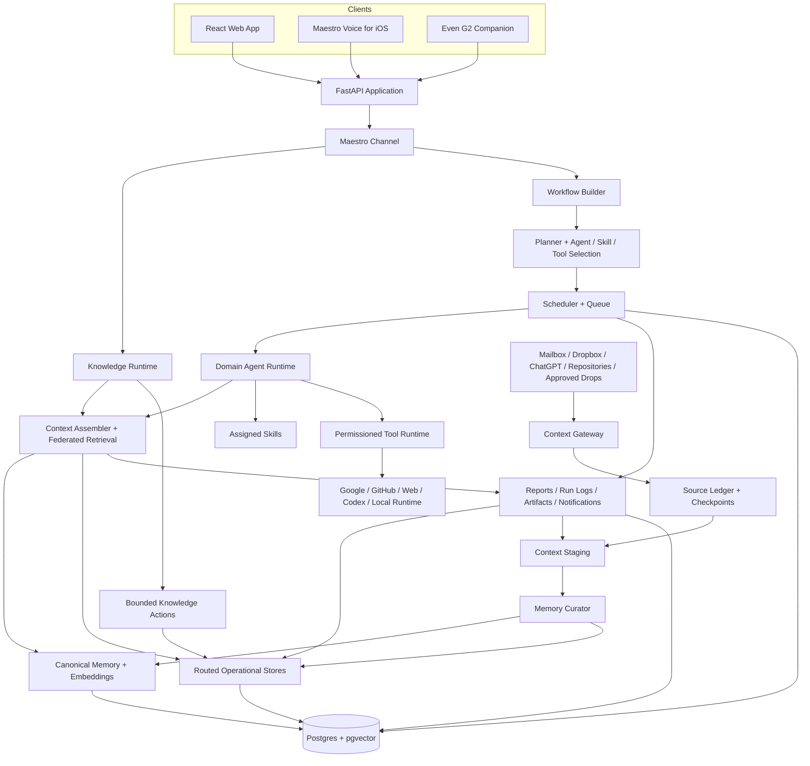

# Maestro

Maestro is a locally hosted AI chief of staff for Chris Aliperti. It maintains a current,
cross-domain understanding of Chris's work and life, provides one primary conversation channel,
and coordinates durable work through domain agents, skills, tools, memory, and a scheduler.

The product has two explicit interaction modes:

- **Knowledge mode** is the everyday interface. Maestro answers questions, reasons over current
  context, and makes bounded updates to calendars, tasks, contacts, organizations, product issues,
  and existing workflows.
- **Build workflow mode** is deliberate. Maestro designs a new multi-step or long-running workflow,
  shows the plan for approval, and then delegates it to agents in the background.

Maestro is currently a single-user, local-first MVP. The web app is the primary interface. A native
[Maestro Voice iOS client](https://github.com/Perti-Laboratories/Maestro-Voice) is also in active
development as a thin voice terminal over the same conversation and Knowledge runtime.

## What Works Today

- One persistent Maestro conversation with Knowledge and Build workflow modes.
- Cross-domain retrieval over durable memory, routed records, reports, run logs, artifacts, and
  authoritative identity context.
- Direct Knowledge actions for work that does not require delegated agent execution.
- Plan-first orchestration with agent selection, dependencies, approvals, RFIs, background
  execution, retries, and result synthesis.
- Domain-scoped agents with editable prompts, memory access, skills, tools, credentials, and model
  assignments.
- Shared GitHub, Google Workspace, web search, Codex, notification, and runtime-management tools.
- Immediate, manual, recurring, and source-triggered workflows managed by a persistent queue.
- Reports, run logs, notifications, routed updates, tangible artifacts, and memory-curation
  artifacts produced from workflow runs.
- A Context Gateway and ingestion ledger for filesystem drops, a dedicated context mailbox,
  ChatGPT exports, repository observations, and sanitized external context packages.
- Curated durable memory with provenance, proposals, deterministic and semantic deduplication,
  embeddings, current-truth supersession, and hygiene.
- Operational stores for contacts, organizations, events, todos, decisions, and product issues.
- Contact and organization intelligence, a cross-domain calendar, recurring todos, agent-owned
  tasks, GitHub issue synchronization, and repository intelligence.
- LLM model tiers, prompt and tool-result compaction, and a durable usage ledger for cost auditing.
- Web access over the local network or a private Tailnet.

## Architecture


```mermaid
flowchart TB
    subgraph Clients
        Web["React Web App"]
        Voice["Maestro Voice for iOS"]
        Glasses["Even G2 Companion"]
    end

    Web --> API["FastAPI Application"]
    Voice --> API
    Glasses --> API

    API --> Channel["Maestro Channel"]
    Channel --> Knowledge["Knowledge Runtime"]
    Channel --> Builder["Workflow Builder"]

    Knowledge --> Context["Context Assembler + Federated Retrieval"]
    Knowledge --> Actions["Bounded Knowledge Actions"]
    Builder --> Planner["Planner + Agent / Skill / Tool Selection"]
    Planner --> Scheduler["Scheduler + Queue"]
    Scheduler --> Agents["Domain Agent Runtime"]
    Agents --> Context
    Agents --> Skills["Assigned Skills"]
    Agents --> Tools["Permissioned Tool Runtime"]
    Tools --> External["Google / GitHub / Web / Codex / Local Runtime"]

    Scheduler --> Outputs["Reports / Run Logs / Artifacts / Notifications"]
    Actions --> Routed["Routed Operational Stores"]
    Outputs --> Routed
    Outputs --> Staging["Context Staging"]

    Sources["Mailbox / Dropbox / ChatGPT / Repositories / Approved Drops"] --> Gateway["Context Gateway"]
    Gateway --> Ledger["Source Ledger + Checkpoints"]
    Ledger --> Staging
    Staging --> Curator["Memory Curator"]
    Curator --> Memory["Canonical Memory + Embeddings"]
    Curator --> Routed

    Context --> Memory
    Context --> Routed
    Context --> Outputs

    Memory --> DB[("Postgres + pgvector")]
    Routed --> DB
    Outputs --> DB
    Scheduler --> DB
```

## Runtime Flows

### Knowledge Turn

Knowledge mode is the default path for conversation and immediate action.

```text
user message
  -> identity grounding and topic context
  -> federated retrieval from relevant domains and stores
  -> Maestro reasoning
  -> optional bounded read/write tool loop
  -> conversational response
```

Maestro can query again after an action to verify the result. It may invoke an existing approved
on-demand playbook, answer or apply an RFI, and edit an existing durable workflow. It does not invent
and delegate a new ad hoc workflow unless Build workflow mode is explicitly selected.

### Delegated Workflow

```text
Build workflow request
  -> plan with work items, agents, skills, tools, models, and dependencies
  -> user review
  -> persistent queue
  -> parallel agent execution where dependencies allow
  -> tool approvals or RFIs only when needed
  -> Maestro synthesis
  -> report, run log, routed changes, artifacts, notification, and memory staging
```

Approved work leaves the chat surface and runs in the background. Blockers and important
notifications return through the main Maestro channel. The scheduler preserves unrelated runnable
lanes when one lane is blocked.

### Context Ingestion

```text
source adapter
  -> normalized context envelope with provenance and policy
  -> idempotent source ledger claim
  -> staging
  -> extraction and candidate evaluation
  -> canonical memory, proposal, or routed record
  -> processed-source archive
```

The Context Gateway controls transport, normalization, checkpoints, and duplicate source versions.
The Memory Curator remains the authority for durable truth. Reports and run logs preserve history;
memory represents Maestro's best current understanding. Routed records may also be created directly
by Knowledge actions and workflows when the user is asking for an operational change now.

## Domains And Boundaries

The seeded domain set currently includes Personal, Praxis, Perti Laboratories, Maestro Development,
USMA, and L3.

- Domain agents operate within one domain and retrieve only context visible to that domain.
- Maestro sits above the domains and may assemble cross-domain context and workflows.
- Global identity grounding tells every runtime that Chris is the user and captures stable ownership,
  company, role, and alias relationships.
- Tool implementations are shared, but credentials and connection settings are resolved per domain.
- USMA and L3 packages must be sanitized and approved before they reach Maestro. Once accepted,
  they use the same provenance-aware curation and retrieval system as other sources. A source can
  still be marked `local_only` when a stricter egress rule is required.

## Agents, Skills, Tools, And Models

An agent is a domain-scoped worker with a role, tasking guidance, model profile, memory profile,
skills, tool permissions, and current execution state. The prompt aggregator combines only the
context needed for that work item: global grounding, domain context, role instructions, selected
skills, relevant memory, dependency handoffs, and the task itself.

Skills are versioned playbooks. They describe when a capability applies, required inputs, ordered
steps, tool guidance, output expectations, failure handling, and safety boundaries. Maestro may
select skills while planning; an agent receives only the skills assigned to its work item or role.

The tool runtime resolves domain connections and secret references, verifies agent permission,
requires approval for high-impact actions, logs every call, and returns compact evidence while
preserving full tool output in the ledger.

Model selection is inspectable at the work-item level. The configured tiers support local Ollama
Qwen plus OpenRouter-hosted Luna, Terra, and Sol profiles. Maestro prefers the lowest tier suitable
for the task while reserving stronger models for planning, synthesis, difficult reasoning, or an
explicit user request. Embeddings are generated separately, locally by default.

## Data And Workflow Outputs

### Durable Memory

Durable memory is atomic, provenance-backed context used for retrieval. New evidence may reinforce,
update, contradict, supersede, or be ignored relative to existing memory. Very high-impact proposals
require approval. Canonical memories carry embeddings for semantic retrieval and links to their
source artifacts.

### Routed Operational Stores

Routed records are current, editable operational objects rather than prompt context disguised as
memory:

- contacts and their aliases, affiliations, interactions, and domain notes;
- organizations and their relationships to contacts and domains;
- events, recurrence, attendees, contextual schedule blocks, and linked work;
- todos, estimates, schedules, recurrence, completion history, and optional agent ownership;
- decisions;
- canonical product issues with project, repository, GitHub sync, relationships, and execution state.

Workflow approvals and RFIs are execution blockers shown under Needs Attention; they are not
general-purpose todo records.

### Reports, Artifacts, And Run Logs

Every agent produces a report object. A completed workflow may produce:

1. **Report** - meaningful human- and agent-readable findings.
2. **Routed changes** - records created, updated, merged, or completed.
3. **Tangible artifacts** - documents, files, code, branches, or pull requests.
4. **Notification** - a deliberate user-facing update when the result warrants one.
5. **Run log** - the durable audit record of timing, agents, tools, outcomes, and output references.
6. **Memory artifact** - one canonical workflow-session package staged for curation.

## Client Surfaces

### Web App

The React/Vite app is the primary control surface. It includes Maestro chat, the artifact renderer,
active and durable workflows, reports, run logs, memory management, calendars, todos, contacts,
organizations, product issues, domains, agents, skills, tools, and usage diagnostics.

### Maestro Voice For iOS

[Maestro Voice](https://github.com/Perti-Laboratories/Maestro-Voice) is a separate native SwiftUI
client under active development. It deliberately contains no agent, memory, or orchestration logic.
The phone captures speech, sends the final transcript to Maestro, and speaks Maestro's response over
the active iOS audio route.

Voice requests use `POST /maestro/respond` with `interaction_mode: knowledge`, `interface: voice`, a
voice response mode, the Maestro `conversation_id`, and an idempotent `client_turn_id`. The backend
can accept a slow voice turn asynchronously and expose its durable status at
`GET /maestro/turns/{client_turn_id}`, allowing the phone to recover the exact response after iOS
suspends the app.

The phone-only loop and backend contract are the current foundation. Physical-device behavior,
generic Bluetooth routing, Siri/App Intent activation, background recovery, APNs, and possible
Push-to-Talk support are developed and validated in the companion repository. See
[the backend voice contract](docs/MAESTRO_VOICE_API.md) for request details.

### Even G2 Companion

`EvenG2/maestro-even-client` is the wearable companion and simulator workspace. It shares Maestro's
backend rather than creating another assistant runtime. Its build and simulator commands are exposed
through the root `Makefile`.

## Repository Layout

```text
app/
  agents/       Domain agent execution and email-triage behavior
  api/          FastAPI application and public routers
  core/         Configuration, logging, time, and shared runtime helpers
  db/           SQLAlchemy models, repositories, seeds, and sessions
  issues/       Product issue capture, reconciliation, sync, and workers
  llm/          Provider clients, model profiles, and usage accounting
  maestro/      Channel, Knowledge runtime, planning, orchestration, scheduler, outputs
  memory/       Context ingestion, curation, retrieval, embeddings, routed intelligence
  prompts/      Versioned Maestro, agent, curator, and skill prompts
  tools/        Permissioned shared tool runtime and adapters
alembic/        Postgres schema migrations
docs/           Architecture, setup, behavior, and operational documentation
EvenG2/         Even G2 companion client and simulator
frontend/       React/Vite web application
scripts/        Runtime, migration, and maintenance commands
tests/          Backend regression and behavioral test matrix
```

## Local Setup

### Requirements

- Python 3.11+
- Node.js and npm
- Docker Desktop
- Ollama for local embeddings and configured local-model tasks

### First-Time Setup

```bash
python3 -m venv .venv
source .venv/bin/activate
pip install -e ".[dev]"
cp .env.example .env
docker compose up -d postgres
alembic upgrade head
cd frontend && npm install
```

Keep credentials in `.env`; it is ignored by git. Domain tool connections stored in Postgres should
reference environment-variable names rather than contain raw secrets.

### Run Directly

```bash
make backend-reload
```

In another terminal:

```bash
cd frontend
npm run dev -- --host 0.0.0.0
```

Open `http://localhost:5173`. The backend health check is `http://localhost:8000/health`.

### Dedicated Runtime

The recommended always-current runtime is a dedicated `main` worktree. It keeps the live app
separate from feature branches and supports approved coding workflows followed by a safe pull and
reload.

```bash
make runtime-setup
make runtime-backend-reload
make runtime-frontend-tailscale
```

After a merge:

```bash
make runtime-hot-restart
```

The runtime commands fast-forward to `origin/main`, migrate the database, start Postgres when
needed, and expose the frontend through the configured `TAILSCALE_IP`. See
[Runtime worktree](docs/RUNTIME_WORKTREE.md) and [Phone access](docs/PHONE_ACCESS.md).

## Configuration

Settings load from `.env` through `app/core/config.py`. Start with `.env.example`; do not commit the
real file. The major configuration groups are:

- database and runtime worker settings;
- OpenRouter and Ollama providers plus Qwen/Luna/Terra/Sol model profiles;
- embedding provider and model;
- authoritative user identity;
- scheduler, Gmail, Calendar, context-mailbox, and hygiene intervals;
- domain-specific Google Workspace and GitHub secret references;
- prompt-size and daily-cost warning limits.

LLM calls are attributed by component, model, task, workflow, token count, and estimated cost in a
durable usage ledger. `GET /workflow-outputs/llm-usage/daily` returns daily, component, and model
usage. External prompts above the configured hard limit are rejected before transmission.

Setup guides:

- [Postgres](docs/POSTGRES.md)
- [Google Workspace](docs/GOOGLE_WORKSPACE_SETUP.md)
- [Personal and Perti integrations](docs/DOMAIN_INTEGRATIONS.md)
- [Context mailbox](docs/CONTEXT_MAILBOX_SETUP.md)
- [Phone and Tailnet access](docs/PHONE_ACCESS.md)

## Memory Dropbox

The default filesystem intake is `maestro_dropbox/`. Each domain has an `inbox`, `processing`,
`processed`, and `failed` lifecycle beneath that root. For example:

```text
maestro_dropbox/praxis/inbox/
maestro_dropbox/maestro-development/inbox/
maestro_dropbox/personal/inbox/
```

Files may be dropped directly or uploaded through Memory Manager. Supported text-bearing files are
extracted, previewed, curated, written with provenance, and moved to their terminal folder.

## Verification

Backend:

```bash
source .venv/bin/activate
pytest -q
```

Frontend:

```bash
cd frontend
npm run build
```

Focused suites:

```bash
pytest tests/test_maestro_knowledge.py -q
pytest tests/test_maestro_orchestrator.py -q
pytest tests/test_agent_runtime.py -q
pytest tests/test_memory_api.py -q
pytest tests/test_scheduler_api.py -q
```

Behavioral test records live in `tests/behavior/` and should be updated when user-visible behavior
changes.

## Documentation

### Interaction And Execution

- [Maestro orchestrator](docs/MAESTRO_ORCHESTRATOR.md)
- [Knowledge context brief](docs/MAESTRO_KNOWLEDGE_BRIEF.md)
- [Agent runtime](docs/AGENT_RUNTIME.md)
- [Scheduler and queue](docs/SCHEDULER_QUEUE.md)
- [On-demand workflows](docs/ON_DEMAND_WORKFLOWS.md)
- [Maestro Voice API](docs/MAESTRO_VOICE_API.md)

### Context And Memory

- [Context ingestion](docs/CONTEXT_INGESTION.md)
- [Memory service](docs/MEMORY_SERVICE.md)
- [Memory curator](docs/MEMORY_CURATOR.md)
- [Memory dropbox](docs/MEMORY_DROPBOX.md)
- [Identity grounding](docs/IDENTITY_GROUNDING.md)

### Operational Intelligence

- [Contact intelligence](docs/CONTACT_INTELLIGENCE.md)
- [Calendar and organization intelligence](docs/CALENDAR_ORGANIZATION_INTELLIGENCE.md)
- [Recurring todos](docs/RECURRING_TODOS.md)
- [Product issue and repository intelligence](docs/PRODUCT_ISSUE_INTELLIGENCE.md)
- [Domain monitors](docs/DOMAIN_MONITORS.md)

### Planning And Maintenance

- [MVP backlog](docs/BACKLOG.md)
- [Work packages](docs/WORK_PACKAGES.md)
- [Codebase cleanup register](docs/CODEBASE_CLEANUP.md)

## Architectural Rules

- Maestro owns cross-domain routing, delegation, scheduling, and synthesis.
- Agents work within one domain; Maestro is the cross-domain authority.
- Sources provide evidence; they do not write durable truth directly.
- Only the Memory Curator writes canonical durable memory.
- Reports and run logs preserve history; memory should converge on current truth.
- Routed objects remain structured and editable instead of becoming unstructured memory.
- Skills describe repeatable methods; tools perform permissioned actions.
- All tool use is logged, and high-impact actions require approval.
- Every agent result becomes a report object with provenance.
- Secrets, local caches, and generated runtime artifacts are never committed.
