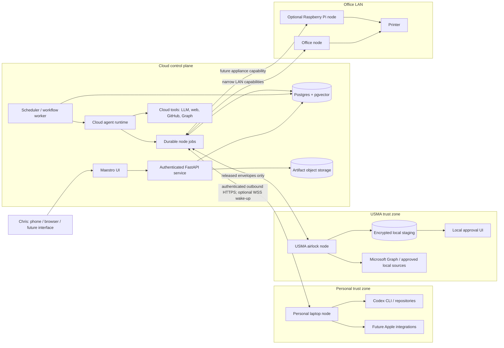
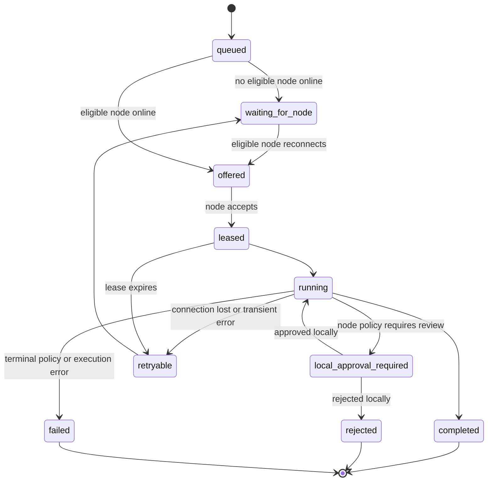
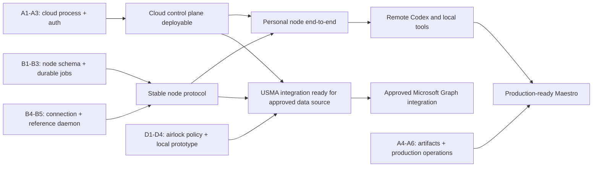

# Cloud Control Plane and Node Implementation Plan

Status: approved direction; node foundation, deployment scaffold, owner auth, and durable artifact
writes are implemented

## Implementation Status — September 23, 2026

- Complete: node registry, capability inventory, health derivation, pause/revoke APIs, and Nodes UI.
- Complete: one-time enrollment, separate device credentials, durable diagnostic jobs, leasing,
  renewal, retries, idempotent completion, expired-lease recovery, and event history.
- Complete: standalone Mac CLI with local Ed25519 identity, permission-restricted state,
  idempotency journal, heartbeats, long polling, reconnect backoff, and `diagnostic.echo`.
- Complete: Render API/worker/Postgres Blueprint, Vercel build configuration, process-role
  separation, readiness checks, deployment validation, and deployment runbook.
- Complete: single-owner OIDC sessions, immutable subject allowlisting, HTTP/WebSocket protection,
  CSRF, logout/revocation, and frontend reauthentication handling.
- Complete: private local/S3 artifact-store abstraction with hashes and storage provenance for
  uploads and workflow/session packages.
- Verified: a real HTTP/Postgres round trip from enrollment through signed diagnostic result.
- Next: S3-backed curator ingestion, durable replacement for API background tasks, and the first
  real node capability (`coding.codex.run`).
- Deferred by design: USMA implementation remains synthetic-only until institutional policy and
  Microsoft tenant authorization are settled.

## Objective

Move Maestro's durable orchestration, memory, agent runtime, scheduler, reports, approvals, and
primary UI to an always-available cloud control plane while preserving access to capabilities that
must execute on a specific computer or local network.

The first two nodes are:

1. A personal development node that runs Codex and later personal Apple integrations.
2. A USMA node that acts as a bidirectional airlock. USMA content must be parsed, filtered, and
   approved locally before it leaves the USMA boundary. Requests and proposed writes from cloud
   Maestro must also be approved locally before they execute inside that boundary.

The cloud control plane remains useful when every node is offline. Work that depends on an offline
node waits durably without blocking independent cloud work.

## Architectural Principles

- Maestro remains the cross-domain control plane and owns routing, delegation, synthesis, and the
  canonical workflow record.
- Agents normally run in the cloud. Tools declare where they are eligible to execute.
- A node is a capability provider and policy-enforcement point, not a second Maestro instance.
- Cloud Postgres is authoritative for workflows, reports, routed objects, and released canonical
  memory.
- A node never receives the entire Maestro memory store. It receives only the context required for
  an authorized job.
- Nodes may return logs, reports, artifacts, and memory proposals. Only the Memory Curator writes
  canonical memory.
- Every remote tool operation uses a durable job, a lease, an idempotency key, and a tool-call audit
  record. A WebSocket is a notification channel, not the source of truth.
- A disconnected node is an expected scheduling condition, not a tool failure.
- Cloud services and nodes both default to read-only capabilities. Writes retain existing approval
  gates and may add stricter node-local gates.
- No USMA source content may enter cloud payloads, logs, traces, or error messages before local
  release approval.

## Fit With the Current Codebase

The current repository has useful seams, but remote execution is not a packaging-only change:

- `ToolExecutionService` already centralizes agent authorization, domain connection lookup,
  tool-call logging, and adapter selection. Add execution placement at this boundary.
- Tool adapters are synchronous today: the caller expects an immediate result and marks the tool
  call complete. Node work needs a durable pending result plus suspension and resumption of the
  agent tool loop.
- `codex.task.run` already depends on a local Codex CLI, machine authentication, and allowlisted
  filesystem roots, which makes it the best first real node capability.
- Workflow queue items already have dependencies, resource locks, attempts, and leases. Node jobs
  should link to those items rather than overloading them; workflow work and an individual remote
  tool execution have different lifecycles.
- Scheduler claims need atomic database locking and expired-lease reconciliation before multiple
  cloud workers or nodes rely on them.
- The FastAPI process currently owns background loops, and several artifact paths assume a local
  filesystem. Cloud deployment requires a standalone worker and an artifact-store abstraction.
- Several model and embedding defaults point to local Ollama. Each must move to a hosted provider
  or become an explicitly node-backed capability.

## Target Architecture

## Execution Locality

Every tool definition gains an execution policy independent of agent permission:

| Locality | Meaning | Example |
| --- | --- | --- |
| `cloud` | Runs in a cloud worker | `web.search`, cloud LLM, Graph after cloud OAuth |
| `node:any` | Any online node with the capability may claim it | Generic approved document extraction |
| `node:specific` | Only the named node may run it | Codex on the personal development laptop |
| `node:preferred` | Prefer one node, allow an explicit compatible fallback | Office printing through office node or Pi |
| `airlock` | Node-local staging and release approval are mandatory | USMA mail/calendar content and writes |

An agent can combine cloud and node tools in one workflow. Dependencies remain at the queue-item or
tool-call level so a waiting node branch does not stop unrelated work.

## Durable Node Job Contract

### Lifecycle

### Required properties

- Globally unique job ID and idempotency key.
- Parent `tool_call_id`, workflow run, queue item, task, agent, and domain references.
- Required capability key and version constraint.
- Locality and target node selectors.
- Redacted, size-bounded input envelope.
- Approval policy and reason.
- Lease owner, lease token hash, expiry, attempt count, and heartbeat timestamp.
- Result schema version, structured output, artifact manifests, hashes, and provenance.
- Node policy decision and local approval receipt when applicable.
- Created, offered, accepted, started, completed, and released timestamps.

Completion must be idempotent. A stale or duplicate lease may submit the same result but must not
create a second tool result, report, routed item, or external write.

## Node Identity and Enrollment

Human authentication and node authentication are separate.

1. Chris creates a short-lived, single-use enrollment code in Maestro.
2. The node generates its own keypair locally.
3. It exchanges the code and public key for a device identity and refresh credential.
4. The private key and refresh credential are stored in the OS keychain or encrypted local store.
5. The node presents short-lived access tokens and signs important result/approval envelopes.
6. Revoking a node invalidates future connections without changing human login credentials.

Initial node states: `pending`, `active`, `degraded`, `offline`, `paused`, `revoked`, and
`upgrade_required`.

Heartbeats should include only operational metadata: node ID, client version, platform, declared
capabilities, active leases, health checks, and timestamps. They must not include directory
contents, email metadata, or other domain data.

## Proposed Persistence Model

### `execution_nodes`

- identity, display name, platform, trust zone, status
- public key/fingerprint and credential rotation metadata
- software version and update channel
- first seen, last seen, last authenticated, revoked at
- node policy summary and non-sensitive health metadata

### `node_capabilities`

- node ID, capability key, version, enabled state
- domain allowlist
- execution mode: read, write, admin
- configuration summary with secrets and sensitive paths kept node-local
- last successful health check

### `node_jobs`

- references to workflow, queue item, task, agent, domain, and tool call
- capability, locality, target/preferred node, status, priority
- idempotency key, input envelope, result envelope
- lease and attempt fields
- local policy and approval fields

### `node_job_events`

Append-only events for offer, claim, heartbeat, local approval, release, completion, retry,
rejection, revocation, and policy denial.

### `node_artifact_manifests`

Metadata and content hashes for files exchanged with object storage. USMA manifests distinguish
local-only staged artifacts from released cloud artifacts.

The existing `tool_calls` record remains the canonical agent/tool audit object. `node_jobs` records
where and how a local execution occurred.

## API and Connection Surface

Initial control-plane endpoints:

- `POST /nodes/enrollment-codes`
- `POST /nodes/enroll`
- `GET /nodes`
- `GET /nodes/{node_id}`
- `POST /nodes/{node_id}/pause`
- `POST /nodes/{node_id}/revoke`
- `GET /nodes/{node_id}/jobs`
- `GET /nodes/{node_id}/events`
- `POST /node/v1/heartbeat`
- `POST /node/v1/jobs/lease`
- `POST /node/v1/jobs/{job_id}/renew`
- `POST /node/v1/jobs/{job_id}/complete`
- `POST /node/v1/jobs/{job_id}/fail`
- `WS /nodes/connect`

Node protocol messages:

- `hello`, `heartbeat`, `capability_manifest`
- `job_offer`, `job_accept`, `job_decline`
- `lease_renew`, `job_progress`
- `local_approval_required`, `local_approval_receipt`
- `artifact_upload_request`, `job_complete`, `job_fail`
- `credential_rotate`, `node_pause`, `node_revoke`

Every message carries a protocol version, node ID, monotonic message ID, correlation ID, timestamp,
and signature or authenticated session binding. Durable request/result payloads travel through HTTPS
endpoints. A WebSocket may notify a node that work exists, but it does not carry authoritative job
state. Long-polling `lease next job` is the baseline and continues to work in environments that
block long-lived WebSockets.

Each node keeps a small local execution journal, initially SQLite. It records job IDs, idempotency
keys, lease generations, external side-effect identifiers, and completed result digests. A repeated
lease can therefore return a prior result instead of repeating a Codex run, email action, calendar
mutation, or print job.

## Personal Development Node

The personal node is the first end-to-end implementation target because Maestro already has real
local adapters for Codex and runtime management.

Initial capabilities:

- `coding.codex.run`
- `git.repository.inspect`
- `local.maestro.inspect`
- `local.maestro.recover`
- optional development artifact upload

Local configuration retains the allowed repository roots, Codex binary path, GitHub CLI state, and
worktree root. The cloud connection stores only a non-sensitive capability summary. The node wraps
the existing Codex and local-app adapters rather than duplicating their behavior.

Future personal capabilities may include Apple Calendar, Reminders, Notes, Mail, Shortcuts, and
local Ollama. Each should be a separately grantable capability rather than a general Apple or shell
permission.

## USMA Airlock Node

The USMA node has two trust decisions, not one:

1. May this USMA-derived information leave the laptop for cloud Maestro?
2. May this cloud-proposed instruction or content enter and execute in the USMA environment?

### USMA to Maestro

1. Retrieve through approved Microsoft Graph delegated access or an approved local source.
2. Store the raw response only in encrypted local staging.
3. Parse, classify, and optionally summarize locally.
4. Apply deterministic redaction and policy checks locally.
5. Present the exact proposed release envelope in the local airlock UI.
6. Chris approves, edits, summarizes further, or rejects it locally.
7. Sign the release manifest and transmit only the approved envelope.
8. Cloud Maestro stores released provenance and may create reports, routed objects, or memory
   proposals within the USMA domain.

### Maestro to USMA

1. Cloud Maestro creates a typed proposal such as an email draft, calendar mutation, or bounded
   query.
2. The USMA node validates schema, source, requested capability, scope, and policy.
3. Store the proposal in local staging without executing it.
4. Present it in the local airlock UI.
5. Chris approves, edits, or rejects locally.
6. Execute through the locally held Graph credential or approved local adapter.
7. Return a minimal signed receipt. Return source content only when separately approved for release.

### Airlock data classes

- `local_only`: raw content that must never leave the USMA node.
- `release_candidate`: locally parsed content waiting for review.
- `released_summary`: approved text/metadata safe for the USMA cloud domain.
- `released_artifact`: approved file or extracted content plus a signed manifest.
- `inbound_proposal`: cloud request waiting for local validation.
- `approved_for_execution`: locally approved bounded write.
- `execution_receipt`: minimal outcome safe to return to cloud.

The local UI is mandatory for any release decision involving unreleased content. A cloud approval
screen cannot make that decision because rendering the content in the cloud would already disclose
it.

Every release also carries a dissemination policy such as `usma_only`, `maestro_cross_domain`, or
`no_memory`. `usma_only` material may support Maestro-level orchestration, but retrieval and prompt
assembly must not place it into another domain's agent context. Cloud health telemetry may report
counts and safe states, never subjects, participants, event titles, tenant identifiers, or raw
failure text.

Released envelopes are immutable and signed over the exact released bytes, transform-chain
versions, policy version, reviewer decision, expiry, and source alias. Source aliases remain local;
when correlation is needed, use a node-held keyed HMAC rather than transmitting a predictable raw
identifier or ordinary hash.

### Microsoft access strategy

Use Microsoft Graph rather than Outlook desktop automation when organizational policy permits.
Start with delegated, tenant-specific authorization-code flow with PKCE and the least privileged
scopes. `Mail.ReadBasic` and `Calendars.ReadBasic` are the metadata-only starting point; full local
summarization requires separately approved read scopes. Modification and send authority are added
independently. Keep the serialized token cache encrypted in the USMA node's OS credential store,
not in cloud Maestro.

Poll Graph delta APIs locally before considering webhooks. Mail cursors are folder-specific and
calendar cursors are scoped to a calendar and time window; all cursor and tenant metadata remains
local. A Render webhook would itself receive organizational subscription/resource metadata and
therefore changes the boundary being designed here.

If the tenant permits a direct cloud Graph connection and policy permits the resulting data to live
in Maestro, a future cloud connector can bypass the node for approved resources. The airlock design
exists for the stricter case and must not assume that cloud OAuth consent will be available.

## Single-Owner Cloud Authentication

Maestro does not need multi-tenant product machinery, but it does need a real security boundary.

- Use one external OIDC identity and pin authorization to the immutable provider subject plus an
  explicit owner allowlist.
- Require MFA/passkey at the identity provider.
- Use short-lived server sessions in secure, HTTP-only cookies for the web UI.
- Validate authentication on REST and WebSocket connections.
- Use CSRF protection for cookie-authenticated writes.
- Do not infer access solely from an email claim.
- Keep node identities, sessions, and revocation separate from the owner session.
- Preserve domain checks even though there is one human user; they constrain agents and nodes.

The simplest first deployment serves the built frontend and API from the same Render origin. This
avoids cross-origin cookies and WebSocket authentication while the security boundary is new. Keep
the frontend API base configurable so it can move to Vercel later. A Vercel frontend should use the
same OIDC identity and call the authenticated Render API directly with an intentionally designed
cross-origin token/session flow.

## Cloud Deployment Shape

### Render first

- Render web service: FastAPI, built frontend, REST, human WebSocket, node WebSocket.
- Render background worker: scheduler, workflow execution, triggers, and curation loops.
- Render Postgres: production database and pgvector.
- Optional Render Key Value: notification/pub-sub acceleration after correctness exists in
  Postgres.
- External object storage: uploaded source artifacts, node artifacts, and generated files.

The API process must stop owning autonomous scheduler, Gmail trigger, and memory-dropbox loops once
the separate worker is active. Both processes use the same service code and separate database
sessions.

FastAPI `BackgroundTasks` must also stop owning durable work. User requests should enqueue and
return; a process replacement must not discard a response, workflow, ingestion, or agent task.
Before running multiple workers, scheduler claims must become atomic through row locks or
conditional updates, expired leases must be reclaimed, and side-effecting tools must reconcile
unknown outcomes before retrying.

### Vercel-ready frontend

- Produce a static production build with an environment-controlled API and WebSocket base URL.
- Remove assumptions that `localhost` or a Tailscale IP is the backend.
- Keep browser authentication portable across the future frontend/backend origin split.
- Do not put durable orchestration, worker execution, or node WebSockets in Vercel functions.

### Production prerequisites

- Backend and worker container images.
- Migration command executed once per deploy.
- Health, readiness, and worker-heartbeat endpoints.
- Managed secrets and key rotation.
- Structured logs with sensitive-field redaction.
- Database backups and restore drill.
- Object retention and deletion policy.
- Error monitoring and deployment rollback.
- Production CORS, trusted proxy, secure-cookie, and origin configuration.
- Local filesystem paths removed from cloud artifact identifiers.

## UI Plan

Add a top-level **Nodes** surface and compact global connection indicator.

Node list fields:

- online/degraded/offline/paused/revoked state
- last seen and client version
- trust zone and domain assignments
- available and unhealthy capabilities
- active, waiting, and recently completed jobs
- pending local approvals without exposing unreleased content

Workflow displays gain:

- `waiting_for_node` as a first-class state
- required capability and selected/preferred node
- last node heartbeat
- whether independent work is continuing
- retry/retarget controls where policy permits

The USMA node card may report counts and status, such as `3 release candidates waiting locally`,
but must not include titles, sender names, snippets, or other unreleased metadata.

## Implementation Workstreams

### Track A: Cloud readiness

A1. Separate the background worker loops from FastAPI lifespan.

A2. Add production containers, frontend build serving, migration command, and health/readiness.

A3. Add single-owner OIDC authentication to REST and WebSockets.

A4. Move artifacts from local paths to an artifact-store abstraction and object storage.

A5. Add Render deployment configuration, managed Postgres, secrets, backups, and monitoring.

A6. Keep the frontend deployable either from Render or as a Vercel static application.

### Track B: Node platform

B1. Add node, capability, job, event, and artifact-manifest schema.

B2. Add enrollment, rotation, heartbeat, pause, revoke, and node-status APIs.

B3. Build the durable job service with leases, idempotency, retry, and offline semantics.

B4. Add authenticated HTTPS long-polling and payload endpoints, then optional WSS wake-ups.

B5. Build a small reference node daemon and local configuration store.

B6. Add remote execution routing behind the existing `ToolExecutionService` boundary.

B7. Add Nodes UI and workflow `waiting_for_node` visibility.

### Track C: Personal development node

C1. Package the existing Codex adapter behind the node executor interface.

C2. Enroll the personal laptop and advertise `coding.codex.run`.

C3. Prove offline wait, reconnect, execution, result submission, and PR provenance.

C4. Move local inspect/recover capabilities behind the node.

C5. Package the node as a user service with local logs, pause, update, and uninstall paths.

C6. Add personal Apple capabilities individually after the platform is stable.

### Track D: USMA airlock

D1. Write an explicit data-release policy and confirm organizational/tenant constraints.

D2. Add an encrypted local staging database and append-only local audit log.

D3. Build the local approval UI and signed release receipts using simulated Outlook payloads.

D4. Implement local parsing, redaction, release-envelope schemas, and policy tests.

D5. Add Microsoft Graph delegated read access if approved.

D6. Add calendar and email write proposals with mandatory local approval.

D7. Add local Graph delta polling after token storage, cursor recovery, and missed-event handling are
proven. Defer webhooks until their metadata exposure and subscription lifecycle are explicitly
approved.

### Track E: Office devices

E1. Expose printer status/submission through an office-computer node with narrow permissions.

E2. Move that capability to a Raspberry Pi node only if independent availability is valuable.

## Dependency and Parallelization Plan

Tracks A, B, and the policy/design portions of D can begin together.

Do not wait for full cloud production hardening before building the node daemon. Develop the node
protocol locally against the FastAPI service, then deploy the same contract to Render.

## Recommended First Delivery Slices

### Slice 1: Node registry and health

- Add node/capability schema and migration.
- Add enrollment and heartbeat APIs.
- Build a CLI reference node that enrolls and reports a synthetic capability.
- Add the Nodes UI with online/offline/last-seen health.
- No remote execution yet.

### Slice 2: Durable remote echo job

- Add node jobs, events, leases, idempotent completion, and reconnect handling.
- Dispatch a harmless `diagnostic.echo` capability.
- Demonstrate that the job waits while the node is offline and completes after reconnect.
- Show `waiting_for_node` in Workflows.

### Slice 3: Personal Codex node

- Wrap `codex.task.run` as `coding.codex.run` on the personal node.
- Preserve allowed roots and credentials locally.
- Return the existing report/tool result contract.
- Verify disconnect, timeout, duplicate completion, and PR provenance behavior.

### Slice 4: Cloud process separation and deployment

- Extract the worker entrypoint.
- Build production containers and same-origin frontend serving.
- Add single-owner login and authenticated WebSockets.
- Deploy API, worker, and Postgres to a non-production Render environment.
- Point the personal node at that environment.

### Slice 5: USMA simulated airlock

- Build local staging and local approval without connecting Microsoft Graph.
- Use representative synthetic email/calendar payloads.
- Prove through tests that raw content never enters cloud DB rows, request logs, or errors.
- Prove bidirectional approval and signed receipts.

### Slice 6: USMA approved integration

- Add the organizationally approved Microsoft access method.
- Start read-only and in shadow mode.
- Add writes only after release behavior has been reviewed in real use.

## Acceptance Scenarios

1. With all nodes offline, Chris can use Maestro from a phone, retrieve released memory, and run
   cloud-only workflows.
2. A coding workflow reaches `waiting_for_node` without consuming its retry budget when the personal
   laptop is offline.
3. Reconnecting the personal node resumes the exact durable job and creates at most one Codex run
   result and one tool-call completion.
4. A Render deploy may disconnect every WebSocket without losing jobs or node identity.
5. Revoking a node prevents new leases and rejects result submissions from old credentials.
6. Cloud workers never execute a node-only adapter locally.
7. USMA raw payloads remain absent from cloud database rows, object storage, logs, traces, and error
   monitoring before local release approval.
8. A cloud compromise cannot directly call Microsoft Graph through the USMA credential; the token
   remains local and every bounded write is checked by the node policy.
9. An email or document containing prompt injection cannot grant itself release or tool authority.
10. Node health and every blocked workflow clearly show the required device/capability without
    leaking protected data.

## Decisions to Resolve Before USMA Production Use

- Whether organizational policy permits a Maestro node on the laptop.
- Whether Microsoft Graph delegated consent is available and which scopes are permitted.
- Whether any USMA-derived summaries may be stored in a commercial cloud and under what retention
  rules.
- Whether local automated summarization is permitted, and which model/runtime may process the data.
- Whether all releases require manual approval or certain metadata classes may be auto-released.
- Whether inbound calendar/email actions may ever be auto-executed.
- Required audit export, retention, revocation, and incident-response procedures.

Until those questions are answered, the USMA track should use synthetic fixtures and implement the
airlock mechanics without touching live organizational data.
