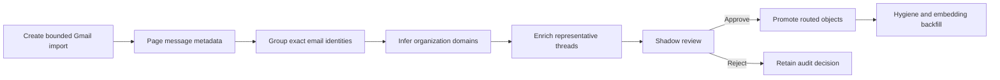

# Contact And Organization Hydration

Historical hydration builds an initial CRM from Gmail without sending every old message through a
normal Maestro workflow. It is a resumable, low-priority background job with an explicit review gate.
A single run creates both contact and organization candidates.

## Lifecycle

Job states are `pending`, `scanning`, `enriching`, `review`, `promoting`, `paused`, `complete`,
`failed`, and `cancelled`. A database lease prevents two backend workers from advancing the same job.
Each promoted record retains Gmail message/thread source references and the hydration job/candidate ID.

## Identity Rules

- Exact email is the primary contact key.
- Chris Aliperti and configured self email are excluded.
- Automated and no-reply addresses are excluded.
- The same display name with a different email stays ambiguous for manual review.
- A non-personal email domain creates an organization candidate but does not prove a polished name.
- Existing records are updated only after an explicit candidate decision; create decisions still
  perform an exact-email guard at promotion time.
- A failure in one candidate is isolated with a savepoint and does not roll back successful peers.

## Cost Controls

The metadata scan uses Gmail only. Representative thread enrichment defaults to local Qwen. Terra
fallback is off by default and, when enabled, has a per-job call cap. Message and contact limits are
stored on each job and the query should be bounded by date, sender, folder, or another Gmail operator.

## UI

Open either **Memory > Contacts** or **Memory > Organizations**, expand **Historical Gmail import**,
and configure the domain, Gmail query, limits, and enrichment policy. Both tabs show the same jobs;
each tab filters candidate review to its own object type. Pause, resume, cancel, approve high-confidence
candidates, or review individual candidates there.

## Suggested First Run

Use Praxis with `in:sent newer_than:30d`, 50 messages, and 25 contacts. Keep local enrichment on and
cloud fallback off. Review both tabs before approving anything. Verify that Chris and automated
accounts are absent, ambiguous duplicate names remain in review, organizations are sensible, and
promoted contacts retain interactions and organization links.
