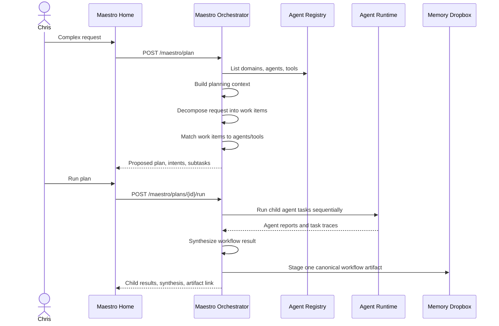

# Maestro Orchestrator MVP

Maestro is the top-level orchestration service. It is not just another domain agent: it owns
workflow planning, approval gates, queue state, delegation, synthesis, and the canonical workflow
artifact that is staged for memory curation.

## MVP Flow

## Planning Contract

The plan is intentionally decomposition-first. A single user message can require workflow
delegation, task capture, contact extraction, event extraction, RFIs, decisions, and memory routing
at the same time. Maestro first asks what work or retained information exists, then matches that
work against the active registry.

The preferred planner is an LLM structured-output pass. The deterministic planner remains as a
fallback when the LLM planner is unavailable.

Every proposed plan includes:

- planner mode, such as `llm` or `deterministic`
- decomposed work items, such as workflow tasks, standalone tasks, contacts, events, decisions,
  RFIs, memory candidates, think tank notes, or direct responses
- whether an RFI blocks execution or can be answered while useful work proceeds
- dependency edges between work items
- planning lanes, which are routing hints such as workflow, task, contact, event, RFI, decision,
  and memory-route
- selected agents and domains
- child subtasks tailored to each selected agent's role summary, current tasking, and tool access
- proposed execution stages derived from dependency edges, so Chris can inspect parallelizable and
  blocked work before running the plan
- expected outputs
- approval requirement
- scheduler/queue notes
- registry snapshot of available agents and tools

Maestro should not send the full user request to every agent in a selected domain. It decomposes
the request into role-sized work items, scores agents by domain, role, tool, and suggested-agent
fit, then writes each child task from the assigned work items. Agents receive user context through
the prompt package, but their tasking objective is scoped to the work items they own.

If the planner emits one broad work item for a multi-role workflow, the resulting plan is too coarse.
The correct shape is several work items, such as demo narrative, technical demo risk, CRM/contact
context, meeting capture plan, and follow-up strategy, with dependencies where later work needs
earlier outputs.

No child task runs during planning.

RFIs, events, contacts, tasks, decisions, and memory candidates found during planning remain
proposal contents until the plan is accepted and executed. This keeps unapproved plans from
polluting the routed operational boards. The plan preview is responsible for showing those items
before execution; the boards represent accepted or observed routed items.

The chat surface is session-oriented. Each user message gets a plain-text Maestro response. If a
plan is active and has not run yet, the next user message is treated as a refinement to that plan:
Maestro replans with the prior work items and subtasks in context. The manual new-session control
closes the active session, stages the transcript as a Maestro Development interaction artifact, and
starts a clean session.

The preferred API entrypoint for user chat is `POST /maestro/respond`. It returns one response
envelope with a `kind` of `chat_only`, `planned`, or `refined`, plus a plain-text Maestro message
and an optional plan payload. Legacy plan/refine endpoints remain available for targeted tests and
tooling, but the UI composer should use the unified response contract.

When a plan is already active, `POST /maestro/respond` first classifies the new message against
that active session. The MVP deterministic classifier distinguishes side-chat, plan refinement,
blocking RFI answers, routed context, and explicit new workflow requests. Side-chat leaves the
active plan untouched. The other active-session classifications either refine the existing plan or
start a separate plan according to the classification.

## Execution Contract

Running an approved plan:

- marks the parent task running
- creates child tasks through the existing agent runtime
- runs each selected agent sequentially in the MVP
- groups subtasks into dependency stages so independent work can be identified as parallelizable
- passes completed upstream work-item outputs into dependent downstream subtasks
- records agent reports and tool calls
- writes one Maestro synthesis report
- marks the parent task completed or failed
- stages one canonical workflow artifact for memory curation

Agent outputs remain traceable reports, but they are not individually staged into memory by default.
The canonical workflow artifact is the memory-curation boundary for a workflow session. It includes
the original user input, decomposition, work items, subtasks, child outputs, synthesis, RFIs, and
provenance.

## Scheduler And Queue Foundation

The MVP scheduler is a queue foundation, not the final recurring scheduler. It records:

- plan-first execution policy
- parent task status
- child task status
- sequential execution order
- plan-level queue items derived from the workflow graph
- queue item status transitions from pending to ready, running, completed, or failed
- child task/report IDs once execution creates durable child tasks
- future resource-lock placeholder
- future recurring-scheduler placeholder

Future work should add resource locks, priority override, recurring workflows, exclusive tool queues,
and conflict-aware scheduling.

## Test Path

Use the Maestro home page:

1. Enter a complex request that mentions at least one domain.
2. Click **Plan**.
3. Review detected intents, selected agents, and generated subtasks.
4. Click **Run plan**.
5. Confirm child runs complete, a synthesis appears, and a canonical workflow artifact is staged.

For a dry run, disable **Execute LLM** before running the plan. This still verifies planning,
queue/task creation, synthesis, and artifact staging without calling the LLM gateway.
