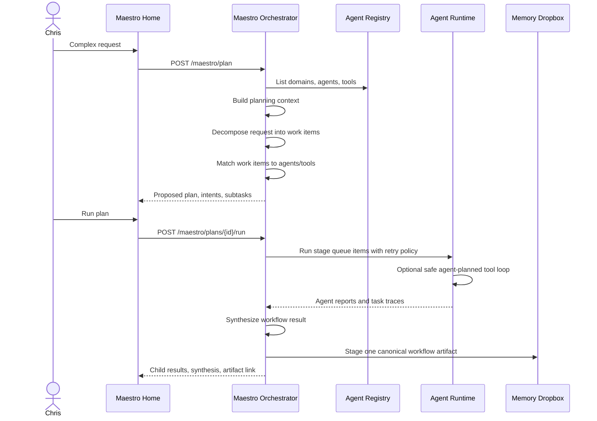

# Maestro Orchestrator MVP

Maestro is the top-level orchestration service. It is not just another domain agent: it owns
workflow planning, approval gates, queue state, delegation, synthesis, and the canonical workflow
artifact that is staged for memory curation.

## MVP Flow

## Planning Contract

The plan is intentionally decomposition-first. A single user message can require workflow
delegation, task capture, contact extraction, event extraction, RFIs, decisions, and memory routing
at the same time. Maestro first asks what work or retained information exists, then matches that
work against the active registry.

The preferred planner is an LLM structured-output pass. The deterministic planner remains as a
fallback when the LLM planner is unavailable.

Every proposed plan includes:

- planner mode, such as `llm` or `deterministic`
- decomposed work items, such as workflow tasks, standalone tasks, contacts, events, decisions,
  RFIs, memory candidates, think tank notes, or direct responses
- whether an RFI blocks execution or can be answered while useful work proceeds
- dependency edges between work items
- planning lanes, which are routing hints such as workflow, task, contact, event, RFI, decision,
  and memory-route
- selected agents and domains
- child subtasks tailored to each selected agent's role summary, current tasking, and tool access
- proposed execution stages derived from dependency edges, so Chris can inspect parallelizable and
  blocked work before running the plan
- expected outputs
- approval requirement
- scheduler/queue notes
- registry snapshot of available agents and tools

Maestro should not send the full user request to every agent in a selected domain. It decomposes
the request into role-sized work items, scores agents by domain, role, tool, and suggested-agent
fit, then writes each child task from the assigned work items. Agents receive user context through
the prompt package, but their tasking objective is scoped to the work items they own.

If the planner emits one broad work item for a multi-role workflow, the resulting plan is too coarse.
The correct shape is several work items, such as demo narrative, technical demo risk, CRM/contact
context, meeting capture plan, and follow-up strategy, with dependencies where later work needs
earlier outputs.

No child task runs during planning.

RFIs, events, contacts, tasks, decisions, and memory candidates found during planning remain
proposal contents until the plan is accepted and executed. This keeps unapproved plans from
polluting the routed operational boards. The plan preview is responsible for showing those items
before execution; the boards represent accepted or observed routed items.

The chat surface is session-oriented. Each user message gets a plain-text Maestro response. If a
plan is active and has not run yet, the next user message is treated as a refinement to that plan:
Maestro replans with the prior work items and subtasks in context. The manual new-session control
closes the active session, stages the transcript as a Maestro Development interaction artifact, and
starts a clean session.

The preferred API entrypoint for user chat is `POST /maestro/respond`. It returns one response
envelope with a `kind` of `chat_only`, `planned`, or `refined`, plus a plain-text Maestro message
and an optional plan payload. Legacy plan/refine endpoints remain available for targeted tests and
tooling, but the UI composer should use the unified response contract.

When a plan is already active, `POST /maestro/respond` first classifies the new message against
that active session. The MVP deterministic classifier distinguishes side-chat, plan refinement,
blocking RFI answers, routed context, and explicit new workflow requests. Side-chat leaves the
active plan untouched. The other active-session classifications either refine the existing plan or
start a separate plan according to the classification.

## Execution Contract

Running an approved plan:

- marks the parent task running
- creates child tasks through the existing agent runtime
- can opt child agents into the safe read-only tool loop so an agent may plan and execute
  authorized tools such as GitHub PR search before writing its final report
- groups subtasks into dependency stages so independent work can be identified as parallel-ready
- marks every queue item in the current stage ready/running before execution
- retries failed queue items once before marking them failed
- blocks downstream dependents when an upstream queue item exhausts retries
- continues independent work when it is not blocked by the failed item
- passes completed upstream work-item outputs into dependent downstream subtasks
- records a phase synthesis after each execution stage
- records agent reports and tool calls
- summarizes child tool activity in the Maestro synthesis and run payload
- writes one Maestro synthesis report
- marks the parent task completed, blocked, or failed
- stages one canonical workflow artifact for memory curation

Agent outputs remain traceable reports, but they are not individually staged into memory by default.
The canonical workflow artifact is the memory-curation boundary for a workflow session. It includes
the original user input, decomposition, work items, subtasks, child outputs, synthesis, RFIs, and
provenance.

The orchestration endpoint accepts `auto_tool_loop` and `max_tool_iterations`. When enabled, each
child agent receives its normal enriched prompt package, asks the LLM for tool calls, executes
currently approved read tools, reasons over those results, and may replan for more tool calls until
the result is sufficient or the iteration limit is reached. Write/action tools are recorded as
`approval_required` proposals with their payload and rationale instead of being executed
automatically. Deterministic tool dispatch is a narrow fallback for planner failures or obvious
direct artifact links; it should not replace the child agent's LLM planning pass.

The current runner enforces parallel-ready queue semantics, retry policy, dependency blocking, and
phase synthesis. Actual concurrent worker execution is intentionally left behind the queue contract
until tool integrations exist and resource locks matter. The scheduler should be able to swap the
stage executor for a true worker pool without changing the plan, queue, or UI contract.

## Scheduler And Queue Foundation

The MVP scheduler now has a durable queue foundation, not the final recurring/background scheduler.
The detailed contract lives in [SCHEDULER_QUEUE.md](SCHEDULER_QUEUE.md). It records:

- plan-first execution policy
- parent task status
- child task status
- dependency stages and parallel-ready queue batches
- plan-level queue items derived from the workflow graph
- queue item status transitions from pending to ready, running, retrying, completed, blocked, or failed
- retry count and error message per queue item
- child task/report IDs once execution creates durable child tasks
- per-stage synthesis notes
- durable workflow runs and queue items
- resource-lock requests and lock leases
- scheduler events for queue observability
- parallel-ready runnable batches
- future recurring trigger execution placeholder

Future work should add resource locks, priority override, recurring workflows, exclusive tool queues,
and conflict-aware scheduling.

## Test Path

Use the Maestro home page:

1. Enter a complex request that mentions at least one domain.
2. Review the proposed workflow map. Each stage shows whether the contained queue items are
   parallel-ready or single.
3. Click a workflow node to inspect the assigned agent, work item IDs, dependencies, retry count,
   rationale, and underlying work item details.
4. If Maestro asks an RFI in chat, answer in the chat box. The active plan should refine rather
   than starting a new workflow.
5. Send a refinement such as "remove that task," "have only the CRM agent do this," "do this first,"
   or "this belongs in Personal." The active plan should preserve unaffected work while updating
   the requested part.
6. Leave **Let agents plan safe tools** enabled when testing GitHub read-tool behavior, then click
   **Run plan**.
7. Confirm child runs complete, tool activity appears when tools were used, write/action tools show
   as approval-required instead of executed, a synthesis appears, phase synthesis appears in the report, and a
   canonical workflow artifact is staged.

For a dry run, disable **Execute LLM** before running the plan. This still verifies planning,
queue/task creation, synthesis, and artifact staging without calling the LLM gateway.

## Hardening Test Scenarios

Use these scenarios before moving from orchestration into tool integration:

- **Parallel-ready plan:** Ask Maestro to prepare a Praxis demo packet with separate narrative,
  technical readiness, CRM/contact, and follow-up work. Expect stage 1 to contain independent
  queue items and the final packet to wait on the relevant upstream work.
- **Blocking RFI loop:** Ask for a workflow with missing attendee/contact/calendar details. Maestro
  should ask the blocking question in chat. Answer in chat and verify the plan refines in the same
  session.
- **Plan refinement preservation:** After a large proposed plan, ask Maestro to remove one task,
  change one agent assignment, reorder one dependency, or move one item to another domain. The
  resulting plan should retain the unaffected work.
- **Retry then recover:** Simulate one failed agent call followed by a successful retry. The queue
  item should end completed with `retry_count` set to `1`.
- **Retry exhaustion:** Simulate a persistent upstream failure. Maestro should retry once, mark that
  queue item failed, block dependent downstream items, and continue anything independent.
- **Canonical memory boundary:** Run a workflow and verify only one canonical Maestro workflow
  artifact is staged for memory curation while child agent reports remain traceable.
- **Side-chat during active plan:** Ask a question about the plan. Maestro should answer directly
  while preserving the active proposed plan.
- **Session close:** Use the new-session control and verify the prior conversation is staged as a
  Maestro Development session artifact.
