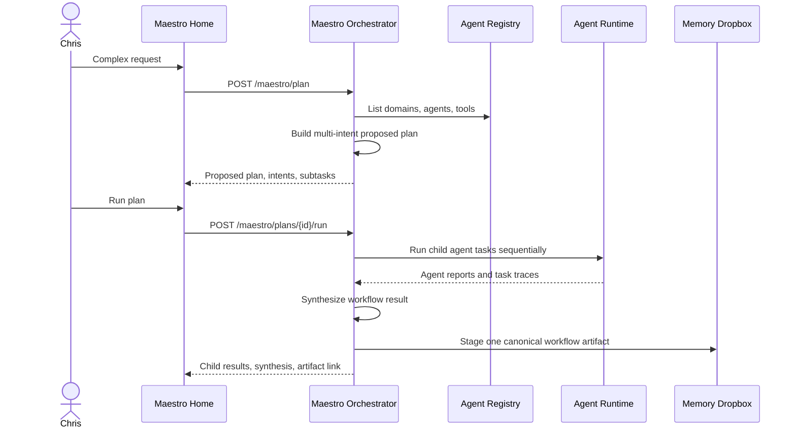

# Maestro Orchestrator MVP

Maestro is the top-level orchestration service. It is not just another domain agent: it owns
workflow planning, approval gates, queue state, delegation, synthesis, and the canonical workflow
artifact that is staged for memory curation.

## MVP Flow

## Planning Contract

The plan is intentionally multi-intent. A single user message can require workflow delegation,
task capture, contact extraction, event extraction, RFIs, decisions, and memory routing at the
same time. The MVP planner uses deterministic hints and the active registry. The later LLM planner
should keep the same shape while improving judgment.

Every proposed plan includes:

- detected intents
- selected agents and domains
- child subtasks
- expected outputs
- approval requirement
- scheduler/queue notes
- registry snapshot of available agents and tools

No child task runs during planning.

## Execution Contract

Running an approved plan:

- marks the parent task running
- creates child tasks through the existing agent runtime
- runs each selected agent sequentially in the MVP
- records agent reports and tool calls
- writes one Maestro synthesis report
- marks the parent task completed or failed
- stages one canonical workflow artifact for memory curation

Agent outputs remain traceable reports, but they are not individually staged into memory by default.
The canonical workflow artifact is the memory-curation boundary for a workflow session.

## Scheduler And Queue Foundation

The MVP scheduler is a queue foundation, not the final recurring scheduler. It records:

- plan-first execution policy
- parent task status
- child task status
- sequential execution order
- future resource-lock placeholder
- future recurring-scheduler placeholder

Future work should add resource locks, priority override, recurring workflows, exclusive tool queues,
and conflict-aware scheduling.

## Test Path

Use the Maestro home page:

1. Enter a complex request that mentions at least one domain.
2. Click **Plan**.
3. Review detected intents, selected agents, and generated subtasks.
4. Click **Run plan**.
5. Confirm child runs complete, a synthesis appears, and a canonical workflow artifact is staged.

For a dry run, disable **Execute LLM** before running the plan. This still verifies planning,
queue/task creation, synthesis, and artifact staging without calling the LLM gateway.
