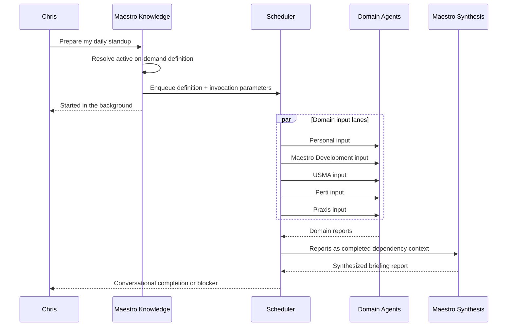

# On-Demand Workflows

On-demand workflows are approved, repeatable playbooks that Chris may launch from Maestro's normal
Knowledge conversation. They bridge immediate Knowledge actions and newly designed orchestration:

- Knowledge mode may invoke an existing active on-demand definition.
- Knowledge mode may not invent or materially redesign a workflow.
- Build workflow mode remains responsible for designing and approving new delegated work.

## Lifecycle

Every invocation uses the normal scheduler lifecycle. Active runs appear in Workflows, blockers
surface through the global Maestro channel, and completion produces reports, a run-log entry, and a
memory-curation artifact.

## Definition Contract

On-demand definitions use `trigger_type: manual`. Their `trigger_config` may include:

- `invocation_aliases`: natural phrases that help Knowledge mode resolve the playbook.
- `parameter_schema`: a small JSON-schema-like object describing optional or required run inputs.
- `approval_policy`: `definition_approved` means installation/activation approves future explicit
  invocations; individual high-impact tools retain their own approval gates.
- `workflow_version`: copied into each run for auditability.

The invocation text, resolved parameters, source message ID, and workflow version are copied into
the immutable run input. A message ID is also the idempotency key, so a retried Knowledge turn cannot
launch the same run twice.

## Initial Playbook

`Daily Standup` runs Personal, Maestro Development, USMA, Perti Laboratories, and Praxis input
tasks in parallel. Every domain lane reviews its canonical calendar, todos, Product Issues, recent
reports, decisions, and durable memory. It separates existing commitments from recommended schedule
additions, proposes role-matched agent handoffs, and asks Chris for material missing input.

A dedicated Maestro Briefing Agent receives all five completed reports and produces a per-domain
walkthrough plus one feasible cross-domain plan for the day. It does not bypass domain memory
boundaries. The synthesis report is attached to the completion message as active standup context,
allowing Chris to discuss it and apply accepted calendar, todo, or issue changes in Knowledge mode.

## Good Next Playbooks

- Project scrum: issues, recent repository state, open decisions, and recommended next work.
- Meeting preparation: relationship history, prior reports, open commitments, and desired outcomes.
- Weekly review: completed work, overdue obligations, upcoming calendar pressure, and reprioritization.
- Repository deep dive: current architecture and issue reconciliation for one selected project.
- Relationship review: recent contact interactions, stale follow-ups, and upcoming meetings.
- Daily learning brief or podcast preparation from selected reports and current research.

These should become durable playbooks only after their output contract and agent/tool requirements
are repeatable. One-off research or coding requests still belong in Build workflow mode.
