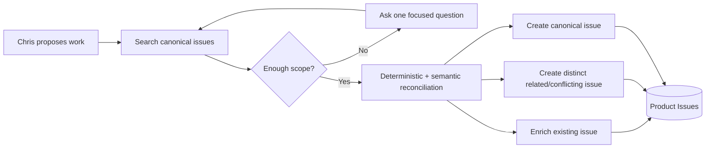

# Product Issue Intelligence

Maestro product issues are a canonical routed store for software and product work. They are not
personal todos and they are not a shadow copy of GitHub. Local ideas and GitHub issues become peer
records with domain, project, repository, provenance, relationships, sync state, and execution state.

The initial portfolio registers Maestro, Praxis/GroundTruth, and the Perti Laboratories projects
Deeper Learning, AAce, and Ophi. Each repository owns a visible Repository Intelligence workflow
and a daily Issue Hygiene workflow. Cheap unchanged checks remain quiet; substantive observations,
sync changes, and failures are preserved in reports and the run log.

## Capture

Clarification is transient conversation state. Maestro does not create a weak local-draft tier. Once
accepted, an issue is canonical regardless of source. Merged submissions remain in provenance so the
original thought and reconciliation rationale are auditable.

Immediate capture uses stable external identity and normalized exact titles first, then retrieves a
small plausible candidate set for semantic adjudication. Broad topical similarity is insufficient to
merge. The result is one of create, merge, relate, conflict, or supersede.

## GitHub Sync

`GitHubIssueSyncService` provides deterministic, paginated two-way synchronization per registered
repository.

- GitHub number/repository is the stable external identity.
- New GitHub issues import into the canonical store.
- Local repository issues with `pending_push` publish to GitHub and gain an external identity.
- GitHub closure updates canonical status to `completed`.
- Local edits to published fields push on the next sync.
- Concurrent local and remote edits become `conflict`; there is no silent last-write-wins overwrite.
- Maestro-only fields such as domain, project, recommendation rank, agent-task state, relationships,
  memory links, and execution history remain Maestro-owned.

## Visible Workflows

Repository registration creates two inspectable durable workflow definitions:

1. `Repository Intelligence - <repository>`
2. `Issue Hygiene - <repository>`

The process-level worker performs only cheap polling and checkpoint checks invisibly. When a repository
commit changes or issue hygiene makes a substantive change, it records a normal workflow run, report,
run-log entry, and memory-staged repository report. Unchanged checks remain quiet.

Issue hygiene repeats semantic reconciliation over likely pairs. It may merge a high-confidence local
duplicate and preserves a `duplicate_of` edge. It never silently collapses two externally distinct
GitHub issues. Related, contradictory, blocking, superseding, and implementation relationships are
first-class records.

Unrequested brainstorming remains in conversation. When Chris explicitly asks Maestro to capture a
product or software idea, Maestro clarifies missing scope and writes it directly into Product Issues.
The former Think Tank routed store has been removed.

## Repository Intelligence

`RepositoryProfile` connects a product project to a GitHub repository, optional local checkout,
source registration, commit checkpoint, durable workflows, sync policy, and two persistent Codex
threads. The current repository observer performs a full baseline, then commit-aware incremental
observations and stages evidence reports through the Context Gateway.

Maestro creates the threads through Codex's local app-server so they appear as normal, named tasks in
the Codex desktop app:

- `{Project Name} Maestro Steward` carries architecture, product-state, and repository continuity;
- `{Project Name} Maestro Worker` performs scoped coding turns for that repository.

The Worker is persistent, but code isolation remains git-owned. Every implementation runs in a fresh
Maestro-managed worktree and records its issue, branch, commit, PR, workflow run, and Worker thread ID.
Work on the same repository is serialized through the shared Worker; repositories may use their own
Workers independently. A missing Codex thread is recreated under the same stable name and the replaced
session ID remains in repository metadata for audit.

The repository, its current git state, project instructions, curated memory, and observer reports
remain authoritative. A Codex thread is useful working continuity, not a replacement for durable
Maestro memory.

## Agent Tasks

Marking a canonical issue as an agent task lets the product-issue worker create a one-time coding
workflow. The issue records its parent task, workflow run, execution, branch, PR, and Codex session.
Missing critical scope creates one chat RFI; the reply resumes the same issue. Completion returns a
normal report/run log and conversational notification.

The Product Issues UI exposes each repository's Steward and Worker names, session state, and most
recent use. An uninitialized repository can create both threads from the UI; the first coding run also
creates and reuses the Worker automatically. The Codex app remains the detailed audit surface for the
complete coding conversation and activity.

## Safety Boundaries

- Original capture and source provenance are retained.
- Semantic resolution only sees a bounded candidate set.
- Weak similarity creates no merge.
- External-vs-external duplicates require explicit review.
- Repository interpretation produces reports first; the Memory Curator remains the only authority
  that turns repository evidence into canonical durable memory.

See [Behavior 013](../tests/behavior/013_product_issue_intelligence.md) and
[Behavior 015](../tests/behavior/015_persistent_project_codex_threads.md) for the human test matrix.
