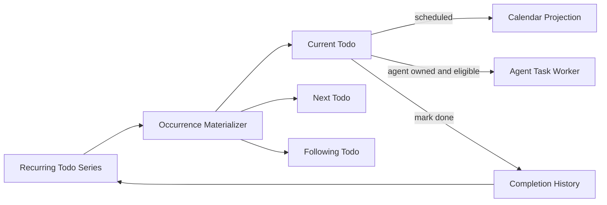

# Recurring Todos

Recurring todos represent durable obligations such as monthly invoicing without treating the
series itself as completed when one period is finished.

## Model

`RecurringTodoSeries` stores the recurrence policy, domain, default task fields, ownership, and
lifecycle status. Generated occurrences are ordinary `Todo` rows linked by `recurring_series_id`
and uniquely identified by `recurrence_original_at`.

The database uniqueness constraint on `(recurring_series_id, recurrence_original_at)` makes
materialization safe to repeat after restarts. The service keeps the latest due occurrence and the
next two future occurrences available. Todo retrieval groups those occurrences to one current card
by default while preserving completed and upcoming rows for inspection.

## Lifecycle

- Completing an occurrence changes only that Todo. The series stays active.
- Pausing a series suppresses generated future occurrences while preserving overdue work and
  completion history. Resuming restores the suppressed upcoming occurrences.
- Ending a series prevents future materialization.
- Scheduled occurrences use the existing scheduled-todo calendar projection.
- Agent-owned occurrences become eligible for background workflow planning only at their scheduled
  time, or at their due time when no scheduled time is present.
- Routed-object hygiene never merges distinct occurrences from the same series.

Knowledge mode creates a series through `todo.create` with `recurrence_rule`,
`recurrence_timezone`, and a first `due_at` or `scheduled_start_at`. It completes an occurrence with
the normal `todo.update` action. Series lifecycle changes use `series_status` or `series_updates`
inside the selected Todo update.
