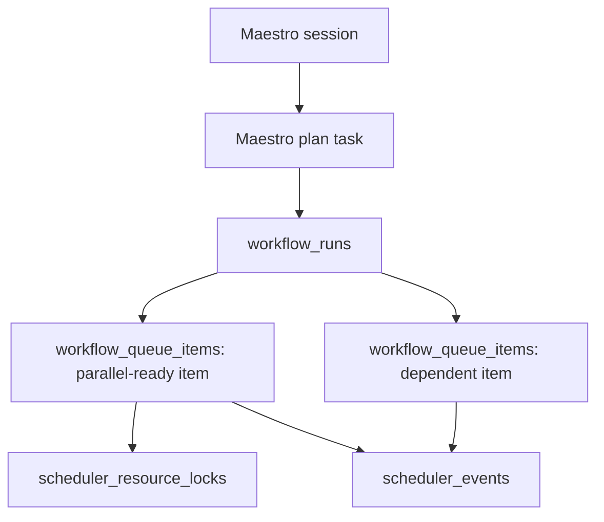

# Scheduler and Queue Foundation

Maestro now has a durable scheduler foundation that sits underneath the existing orchestrator queue.
The current orchestrator can still execute a workflow synchronously from the UI, but every Maestro
plan is mirrored into scheduler tables so queued work, resource conflicts, and session continuity can
survive frontend reloads and future background workers.

## Core Concepts

## Tables

- `workflow_definitions`: reusable workflow templates, recurring trigger config, priority, and
  fairness group. This is where daily standup-style recurring workflows will live.
- `workflow_runs`: one scheduled/manual/autonomous execution instance. A Maestro chat workflow
  creates one run linked to the parent `tasks` row.
- `workflow_queue_items`: durable task-level queue lanes derived from the workflow graph. Each item
  stores status, stage, dependency keys, resource locks, attempts, lease info, and output references.
- `scheduler_resource_locks`: lock leases for exclusive or shared tool/resource use.
- `scheduler_events`: append-only queue observability log.

## Parallelization

The scheduler computes `runnable_batches` by selecting queue items whose dependencies are complete.
Items in the same batch are parallel-ready, subject to:

- dependency keys
- active resource locks
- domain/fairness group selection
- item status

The synchronous orchestrator still runs in-process today because the current SQLAlchemy session and
agent runtime are not thread-safe. The durable queue contract lets the next slice add background
workers that run queue items with separate database sessions.

## Resource Locks

Each queue item can request locks such as:

- `agent:maestro-coding-agent` as `exclusive`
- `tool:github.pr.merge` as `exclusive`
- `tool:github.pr.search` as `shared`

Exclusive locks prevent conflicting work from running at the same time. Shared locks are recorded so
the scheduler can reason about tool pressure without blocking safe read-only work.

## Fairness

Every run and queue item has a `fairness_group`, currently derived from the domain when possible.
The first policy prevents one group from flooding every runnable slot when other groups have ready
work. Later, Chris can manually adjust domain priority day to day without changing workflow logic.

## Session Continuity

Maestro chat sessions are persisted in `conversations` and `messages`. The active session id is kept
in `runtime_settings.active_maestro_conversation`, so after a hot reload the frontend can restore the
same chat session and keep follow-up context.

Session close still stages a transcript artifact for memory curation. Starting a new session clears
the active pointer and creates a fresh conversation.

## Next Slices

- Background worker loop with separate DB sessions and leases.
- Recurring trigger evaluator for `workflow_definitions`.
- Queue editing operations for Maestro priority overrides.
- UI drill-down for scheduler events and locks.
- Resource policy registry per tool family.
