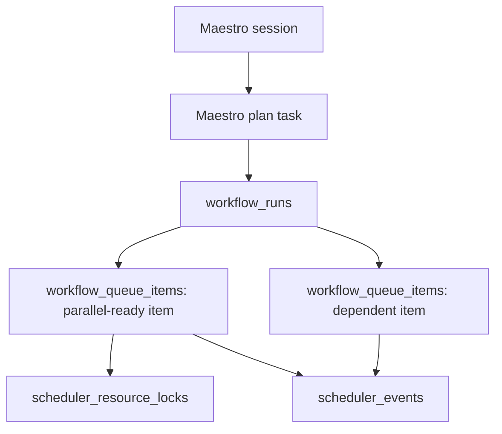

# Scheduler and Queue Foundation

Maestro now has a durable scheduler foundation that sits underneath the existing orchestrator queue.
The current orchestrator can still execute a workflow synchronously from the UI, but every Maestro
plan is mirrored into scheduler tables so queued work, resource conflicts, and session continuity can
survive frontend reloads and future background workers.

## Core Concepts



## Tables

- `workflow_definitions`: reusable workflow templates, recurring trigger config, priority, and
  fairness group. This is where daily standup-style recurring workflows will live.
- `workflow_runs`: one scheduled/manual/autonomous execution instance. A Maestro chat workflow
  creates one run linked to the parent `tasks` row.
- `workflow_queue_items`: durable task-level queue lanes derived from the workflow graph. Each item
  stores status, stage, dependency keys, resource locks, attempts, lease info, and output references.
- `scheduler_resource_locks`: lock leases for exclusive or shared tool/resource use.
- `scheduler_events`: append-only queue observability log.

## Parallelization

The scheduler computes `runnable_batches` by selecting queue items whose dependencies are complete.
Items in the same batch are parallel-ready, subject to:

- dependency keys
- active resource locks
- domain/fairness group selection
- item status

The synchronous orchestrator still runs in-process today because the current SQLAlchemy session and
agent runtime are not thread-safe. The durable queue contract lets the next slice add background
workers that run queue items with separate database sessions.

## Resource Locks

Each queue item can request locks such as:

- `agent:maestro-coding-agent` as `exclusive`
- `tool:github.pr.merge` as `exclusive`
- `tool:github.pr.search` as `shared`

Exclusive locks prevent conflicting work from running at the same time. Shared locks are recorded so
the scheduler can reason about tool pressure without blocking safe read-only work.

## Fairness

Every run and queue item has a `fairness_group`, currently derived from the domain when possible.
The first policy prevents one group from flooding every runnable slot when other groups have ready
work. Later, Chris can manually adjust domain priority day to day without changing workflow logic.

## Session Continuity

Maestro chat sessions are persisted in `conversations` and `messages`. The active session id is kept
in `runtime_settings.active_maestro_conversation`, so after a hot reload the frontend can restore the
same chat session and keep follow-up context.

Session close still stages a transcript artifact for memory curation. Starting a new session clears
the active pointer and creates a fresh conversation.

## Next Slices

- Background worker process that repeatedly calls the claim/complete/fail primitives with separate
  DB sessions.
- Deeper recurring trigger UI for `workflow_definitions`.
- Rich queue editing UI for Maestro priority overrides.
- UI drill-down for scheduler events and locks.
- Resource policy registry per tool family.

## Worker Primitives

The foundation includes the service/API primitives the worker process will use:

- `POST /scheduler/triggers/enqueue-due`: enqueue due scheduled/recurring definitions.
- `POST /scheduler/triggers/event`: enqueue event-triggered definitions, such as a new email event.
- `GET/PATCH /scheduler/triggers/gmail/status`: inspect or toggle Gmail History monitoring.
- `POST /scheduler/triggers/gmail/poll`: run one Gmail trigger poll for debugging.
- `POST /scheduler/triggers/gmail/domains/{domain_key}/reset`: bootstrap a domain at Gmail's
  current cursor without processing historical messages.
- `POST /scheduler/runs/{run_id}/replay`: queue a fresh run with the original trigger payload.
- `POST /scheduler/tick`: enqueue due definitions and claim runnable work in one scheduler cycle.
- `POST /scheduler/worker/claim`: claim currently runnable queue items, acquire locks, and set leases.
- `POST /scheduler/queue-items/{id}/complete`: mark work complete and unblock dependents.
- `POST /scheduler/queue-items/{id}/fail`: retry or fail work based on attempt count.
- `PATCH /scheduler/queue-items/{id}`: edit status, priority, or fairness group.

The current PR does not start a background daemon inside the API process. That is intentional: the
worker should run with its own database session lifecycle and process supervision.

## Trigger Examples

Time-based workflow:

```json
{
  "key": "daily-before-eight",
  "name": "Daily Before 8",
  "trigger_type": "recurring",
  "trigger_config": {
    "time_of_day": "07:55",
    "interval_minutes": 1440
  },
  "workflow_spec": {
    "queue_items": [
      {"id": "brief", "objective": "Prepare the daily brief.", "domain_key": "personal"}
    ]
  }
}
```

Event-based workflow:

```json
{
  "key": "praxis-email-triage",
  "name": "Praxis Email Triage",
  "trigger_type": "event",
  "trigger_config": {
    "event_type": "gmail.message.received",
    "filters": {"domain_key": "praxis"}
  },
  "workflow_spec": {
    "queue_items": [
      {"id": "triage", "objective": "Triage the new Praxis email.", "domain_key": "praxis"}
    ]
  }
}
```

## Gmail History Producer

The backend contains a disabled-by-default Gmail History heartbeat. It watches only domains that
have an active event definition for `gmail.message.received`. On first activation it records the
account's current Gmail `historyId` and emits no events, preventing accidental historical inbox
processing. Later polls:

1. Request `messageAdded` history after the persisted cursor.
2. Deduplicate message ids across all returned pages.
3. Fetch current metadata and accept only messages labeled `INBOX` and not `DRAFT`, `SENT`, `SPAM`,
   or `TRASH`.
4. Emit an event whose id is `{domain_key}:{message_id}` and whose payload freezes the exact Gmail
   message and thread ids.
5. Advance the cursor only after all eligible events have been handed to the scheduler.

Scheduler run idempotency prevents restarts or repeated history pages from creating duplicate runs.
If Gmail has expired an old cursor, Maestro resets to the current cursor, records the warning in
trigger health, and does not guess at the missing interval. Trigger health and manual cursor reset
are visible in the Workflows UI. Keep the Gmail trigger worker off until the intended durable email
workflow definition has been reviewed and activated.
