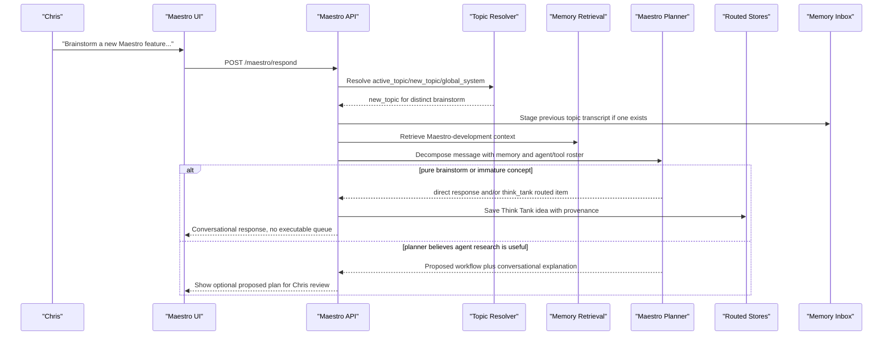
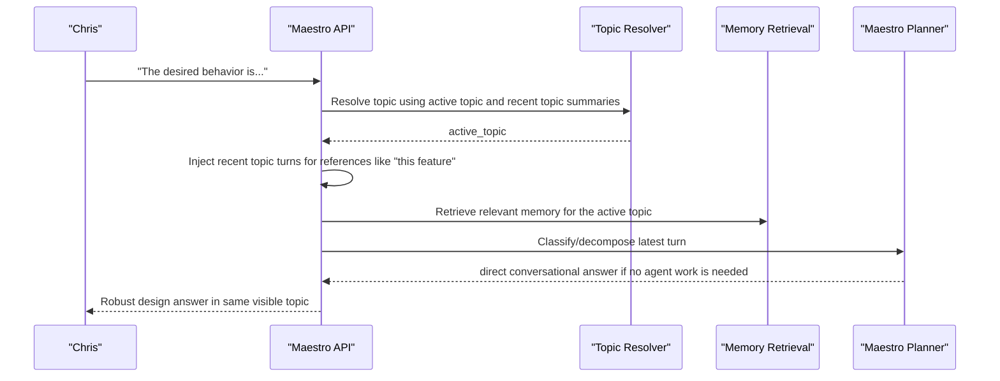
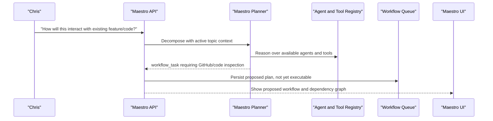
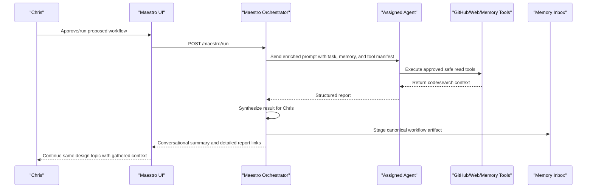

# Behavior Test 001: Code Feature Design Discussion

## Goal

Validate that Maestro can distinguish open-ended design conversation from executable workflows,
manage topic/session boundaries, retrieve relevant Maestro Development context, escalate to agent
work only when needed, and return to the conversation after tool-assisted research.

## Setup

- Backend running against local Postgres.
- Frontend running locally.
- Maestro Development domain and coding/GitHub-capable agents exist.
- GitHub tools are configured for the Maestro repo.
- Memory retrieval has enough Maestro Development context to answer architecture/design questions.

## Test Matrix

| ID | User Message | Expected Behavior | Status | Observed Behavior | Fix / Notes |
| --- | --- | --- | --- | --- | --- |
| 1.1.a | "Hey Maestro I want to brainstorm a new feature for Maestro Development" | Maestro identifies the Maestro Development domain and can pull relevant memory into chat. | Pass | Planner selected `maestro-development`; fresh retrieval for the same query returned 7 relevant memories, including shared-tool infrastructure and agent-boundary preferences. | Need better UI/debug visibility into what memory was actually included in a given planner/agent turn. |
| 1.1.b | Same as 1.1 | Maestro recognizes this as conversation that does not yet require agents or a workflow and responds with text. | Partial | Planner produced a good direct response saying this is brainstorming, but also proposed a detailed workflow with Chief Engineer and SOTA Researcher subtasks. The SOTA lane blocked because `llm.gateway` was not registered as an auto-safe executable tool. | Expected behavior may need split: simple brainstorm should stay chat-only; complex brainstorm may offer optional workflow while still preserving conversational mode. Fixed `llm.gateway` as an internal auto-executable tool; true live SOTA research still needs a separate `web.search` tool. |
| 1.1.c | Same as 1.1 | Maestro recognizes this as a new topic and creates a new chat session memory/topic boundary. | Implemented / pending human rerun | Backend now stores an `active_topic` on the primary Maestro channel and tags user/Maestro messages with a `topic_id`. | Automated API coverage verifies a new feature brainstorm starts a fresh topic. |
| 1.1.d | Same as 1.1 | Maestro UI clears the chat window for the new topic while preserving the broad global Maestro channel model. | Implemented / pending human rerun | Conversation payloads now return only messages for the active topic when a topic is active. | Automated API coverage verifies old visible messages disappear when a new topic starts, while the primary channel id remains stable. |
| 1.2.a | "The desired behavior is... what's the best pattern to implement here" | Maestro recognizes this as conversational follow-up and gives a robust answer without tasking agents. | Not run | | |
| 1.2.b | Same as 1.2 | Maestro recognizes this follows the previous message and stays in the same topic/session. | Not run | | |
| 1.3.a | "How will this new feature interact with ... existing feature" | Maestro recognizes this is still the same conversation/topic. | Not run | | |
| 1.3.b | Same as 1.3 | Maestro recognizes it needs current Maestro codebase context. | Not run | | |
| 1.3.c | Same as 1.3 | Maestro proposes a workflow to task an appropriate agent to inspect/read relevant GitHub code and return a report. | Not run | | |
| 1.4.a | User approves proposed workflow. | Workflow runs and returns the necessary code/context report. | Not run | | |
| 1.4.b | Same approval flow | Maestro uses the returned information to jump back into the design conversation. | Not run | | |
| 1.4.c | Same approval flow | Maestro answers the original interaction question using the returned agent report. | Not run | | |
| 1.4.d | Same approval flow | Completed workflow disappears from active Workflows and appears in Run Log with report/artifact references. | Not run | | |
| 1.4.e | Same approval flow | Generated report appears in Reports and renders Markdown cleanly. | Not run | | |
| 1.4.f | Same approval flow | Chat dashboard right pane can render a selected report or latest workflow artifact without showing legacy queue/debug panels. | Not run | | |
| 1.4.g | Reports cleanup | Reports can be archived from the Reports surface and archived reports disappear from default report/context retrieval. | Implementation pass / pending human validation | Existing local reports were soft-archived to start human testing from a clean report box. | Report content/format cleanup is logged in the backlog as a separate polish item. |
| 1.5.a | After continued design conversation: "This feature design looks good add it as an issue" | Maestro creates a workflow to generate a GitHub issue. | Not run | | |
| 1.5.b | Same as 1.5 | Workflow runs and notifies the user of required approvals. | Not run | | |
| 1.5.c | Same as 1.5 | Maestro notifies the user when the run is complete. | Not run | | |

## Pass Criteria

- Maestro does not create workflows for early brainstorming messages.
- Maestro preserves the same topic/session across clear follow-up design messages.
- Maestro starts a new topic/session when the user clearly opens a new design discussion.
- Maestro escalates from conversation to workflow only when current codebase/tool context is needed.
- Workflow approval, execution, and completion notifications surface through the main chat.
- Active and durable workflows are inspected from Workflows, not from a queue/debug panel on the
  main chat dashboard.
- Reports render in the Reports tab, and selected reports can be viewed in the chat dashboard's
  right-side artifact/report renderer.
- Reports can be archived without deletion; archived reports are hidden from default Reports,
  Maestro context, and agent report search.
- Completed workflow history appears in Run Log with linked reports, artifacts, routed items, and
  agent-work summaries.
- After workflow completion, Maestro resumes the design conversation with the newly gathered code
  context rather than treating the agent report as a disconnected task.
- GitHub issue creation happens only after the user asks to convert the agreed feature design into
  an issue and any required approval gates are satisfied.

## Internal Sequence Diagrams

### 1.1 New Feature Brainstorm



### 1.2 Follow-On Design Conversation



### 1.3 Escalate From Conversation To Codebase Research



### 1.4 Approved Workflow Returns To Conversation



### 1.5 Convert Agreed Design Into GitHub Issue

```mermaid
sequenceDiagram
    participant C as "Chris"
    participant API as "Maestro API"
    participant Planner as "Maestro Planner"
    participant Agent as "Maestro Development Agent"
    participant GitHub as "GitHub Tool"
    participant Inbox as "Memory Inbox"

    C->>API: "This design looks good; add it as an issue"
    API->>Planner: Decompose with active topic transcript and memory
    Planner-->>API: workflow_task requiring github.issue.create
    API-->>C: Proposed issue-creation workflow
    C->>API: Approve workflow/tool call
    API->>Agent: Execute issue creation task
    Agent->>GitHub: Create issue from agreed design
    GitHub-->>Agent: Issue URL and number
    Agent-->>API: Completion report
    API->>Inbox: Stage canonical workflow artifact
    API-->>C: Chat summary with issue link and next steps
```

## Test Runs

### Run 1

- Date: 2026-07-08 11:59 EDT
- Branch: `codex/routed-memory-stores`
- Tester: Chris
- Backend URL: local backend
- Frontend URL: local frontend
- Notes: Initial 1.1 message was more complex than a pure brainstorm. Maestro treated it as a
  brainstorm but also proposed an optional workflow. SOTA Researcher blocked on `llm.gateway`
  approval, not a web-search tool. That approval bug is fixed by registering `llm.gateway` as an
  internal auto-executable tool; add a future `web.search` tool for real current-state research.

| Matrix IDs Tested | Result | Notes / Defects |
| --- | --- | --- |
| 1.1.a | Pass | Domain and memory retrieval looked correct from backend inspection. |
| 1.1.b | Partial | Direct brainstorm response was good, but workflow was created immediately. Need clearer threshold between chat-only brainstorm and optional/recommended workflow. `llm.gateway` approval blocker patched after this run. |
| 1.1.c | Partial | New topic/session boundary may exist only implicitly in the primary channel. |
| 1.1.d | Fail | UI did not clear for a new topic; needs design decision. |

### Run 2

- Date: 2026-07-08
- Branch: `codex/routed-memory-stores`
- Tester: Automated API regression
- Notes: Implemented topic-state handling inside the single Maestro primary channel. This keeps
  Maestro as the system-level orchestrator while letting the visible chat window behave like a
  fresh working session when Chris starts a new topic. A hybrid topic resolver now keeps hard
  deterministic rules for obvious system/refinement cases, then can use the local topic resolver
  model to choose active topic, existing topic, new topic, or global system for ambiguous turns.
  Recent topic history is summarized, keyworded, and capped at 24 stored topics / 8 resolver
  candidates.

| Matrix IDs Tested | Result | Notes / Defects |
| --- | --- | --- |
| 1.1.c | Pass in automated API test | New feature brainstorm creates a new `active_topic` with a new topic id. |
| 1.1.d | Pass in automated API test | Response conversation contains only the new topic's user/Maestro messages, so the UI clears naturally. |
| 1.2.b / 1.3.a | Pass in automated API test | Follow-up wording such as "this feature" stays in the active topic instead of creating a new topic. |
| Topic recall | Pass in automated API test | Resolver can restore an older topic and make that topic's messages visible again. |
| Topic hygiene | Pass in automated API test | Stored prior-topic list is capped and each archived topic carries compact summary/keyword metadata. |

### Run 3

- Date: 2026-07-11
- Branch: `codex/routed-memory-stores`
- Tester: Chris plus automated API/runtime regression
- Notes: Chris tested a new file-import feature discussion after an earlier iMessage feature
  discussion. Backend inspection showed Maestro incorrectly kept the iMessage `active_topic` for
  the file-import request. The workflow did complete and generated main-channel summaries, but the
  manual run was still labeled as a scheduled workflow in some internal messages. The run also
  exposed two implementation defects: dependent work items assigned to the same agent were grouped
  into one subtask, and `github.read` was exposed to agents without a default runtime adapter.

| Matrix IDs Tested | Result | Notes / Defects |
| --- | --- | --- |
| 1.1.c | Fail in human run / fixed in automated regression | Added coverage for `Lets plan a new feature that...` so it starts a fresh topic even when the active topic is another feature discussion. |
| 1.1.d | Fail in human run / fixed in automated regression | The visible chat stayed on the old iMessage topic during the human run. The new regression verifies file-import starts a new visible topic and hides the old iMessage messages. |
| 1.3 / 1.4 workflow execution | Partial | Workflow completed and posted summaries to the main channel, but summary wording still sometimes says `scheduled workflow` for a manual/test run. |
| Same-agent dependencies | Fixed in automated regression | Dependent same-agent work now becomes sequential subtasks/stages instead of one parallel subtask. |
| Safe GitHub read tool | Fixed in automated regression | Registered `github.read` in default adapters and added deterministic search-term expansion for aggregate repo reads. |
| Prompt token usage | Improved | Latest inspected live run had final agent prompt around 20k chars, with raw tool output 24,912 chars compacted to 4,354 chars before reuse. Earlier comparable final prompts were roughly 49k-59k chars. |

### Run 4

- Date: 2026-07-11
- Branch: `codex/routed-memory-stores`
- Tester: Chris plus backend inspection
- Notes: Chris reran the behavior test with a voice-input feature discussion. The inspected
  workflow completed, and a later direct question in the same topic got a direct conversational
  answer. The progress display appeared stuck on `Not Started`; backend inspection showed the run
  itself had progressed to `Workflow complete`, so the UI was over-trusting stale `current_step`
  text. The run also showed old `github.read` failures from a stale backend and two recoverable
  `llm.gateway` failures caused by agents sending a `task` payload instead of `prompt`.

| Matrix IDs Tested | Result | Notes / Defects |
| --- | --- | --- |
| 1.1.c / 1.1.d | Pass in inspected run | Active topic was a fresh voice-input topic. A later follow-up stayed in that topic. |
| 1.2 / direct conversation | Pass in inspected run | "Would this endpoint..." returned a direct conversational answer instead of creating a workflow. |
| 1.3 / 1.4 workflow execution | Pass with polish remaining | Workflow completed and posted completion messages. Some older messages still used `scheduled workflow` wording for manual workflow output. |
| Progress reporting | Fixed after run | Backend and UI now report proposed, scheduled, queued, ready, running, retrying, approval-required, blocked, failed, completed, and archived states instead of letting stale `Not started` text dominate. |
| `github.read` | Likely stale-backend failure | Latest inspected failure text came from before the backend had the default `github.read` adapter loaded. Restart required before retest. |
| `llm.gateway` payload alias | Fixed after run | Adapter now accepts `prompt`, `input`, `task`, `request`, or `instruction`, preventing wasted failed tool calls when agents phrase internal synthesis as a task. |
| Prompt token usage | Improved but monitor large dependency prompts | Planner prompt context was 12,659 chars with registry 8,946 chars. Final SOTA prompts were ~15k chars after compacting 52k-66k raw tool output into ~7k prompt chars. One dependent Chief Engineer synthesis still had a 32,499-char base prompt, so dependency-context compression remains a watch item. |

### Run 5

- Date: 2026-07-11
- Branch: `codex/routed-memory-stores`
- Tester: Chris plus backend inspection
- Notes: Chris brainstormed a Maestro mobile Tailscale tunnel feature. Direct chat behavior was
  strong, including Markdown-formatted response content. When Chris asked to create a GitHub issue,
  Maestro incorrectly created a recurring schedule candidate. Follow-up corrections such as "do
  not schedule this" and "run now" still produced schedule candidates because deterministic
  scheduling heuristics inspected hidden topic context and matched negated schedule wording.

| Matrix IDs Tested | Result | Notes / Defects |
| --- | --- | --- |
| 1.1 / 1.2 direct brainstorm | Pass | Maestro opened a fresh topic and responded conversationally with no unnecessary workflow. |
| 1.5 issue creation | Fail in human run / fixed in automated regression | A one-time "create GitHub issue" request was turned into a recurring workflow. Schedule detection now uses explicit classifier `workflow_timing` when available and falls back only to visible latest-message text. |
| Schedule correction | Fail in human run / fixed in automated regression | "Do not schedule / run now / only once" now suppresses scheduled workflow candidates. |
| UI progress status | Fixed after run | Sending a new Maestro message now clears stale completed `maestroRun` state immediately, so the progress row does not keep showing the previous workflow's complete status. |
| Cleanup | Done | Accidental Tailscale recurring workflow definition and related test runs were archived from the local DB. |
| Prompt token usage | No material regression observed | The patch adds small classifier fields and prompt guidance, but avoids repeated bad scheduling loops and should reduce wasted planning turns. |

### Run 6

- Date: 2026-07-12
- Branch: `codex/system-interaction-rework`
- Tester: Automated backend/frontend regression
- Notes: This PR implements the broader Maestro interaction rework. It adds canonical workflow
  output storage, read APIs, Run Log / Reports / Workflows UI surfaces, Skills registry and
  assignment, report retrieval tools for agents, the unified Maestro context assembler, and the
  simplified main chat dashboard with a right-side artifact/report renderer. Manual rerun should
  inspect workflow output through these durable surfaces instead of relying on chat snippets or
  queue debug cards.

| Matrix IDs Tested | Result | Notes / Defects |
| --- | --- | --- |
| 1.4 workflow execution outputs | Backend foundation pass | Scheduler worker completion writes a run-log entry, delivered notification, staged artifact linkage, and agent-work summary. |
| 1.4 report inspection | UI foundation pass | Reports tab lists generated reports and renders selected report Markdown. |
| 1.4 run history inspection | UI foundation pass | Run Log tab lists completed workflow runs with report/artifact ids and expandable agent-work summaries. |
| 1.4 active workflow inspection | UI foundation pass | Workflows tab separates active runs, scheduled workflows, and trigger workflows from completed run history. |
| 1.4 dashboard renderer | UI foundation pass | Main chat dashboard is now chat plus a right-side artifact/report renderer with compact attention items; the hidden legacy Queue panel was removed. |
| 1.4 Maestro context | Backend foundation pass | Direct chat and planning now use `MaestroContextAssembler` to combine durable memory, routed objects, reports, run logs, artifact metadata, and web-search availability. |
| 1.4 / 1.5 agent retrieval | Backend foundation pass | Agents receive safe internal `reports.search` and `reports.get` tools by default, separate from durable memory retrieval. |
| Skill-scoped agent execution | Backend/UI foundation pass | Skills can be created, assigned to agents, and included in prompt aggregation only for assigned agents. |
| Main UI simplification | Implementation pass / pending human validation | Maestro sidebar has Chat, Run Log, Workflows, Reports, plus Skills beside Tools. The chat dashboard no longer carries the old queue/debug panel. |
