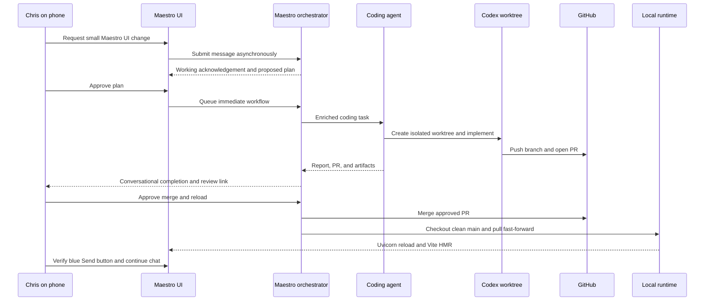

# Behavior Test 002: Maestro Self-Improving Coding Loop

## Purpose

Verify that Chris can ask Maestro, including from the phone over Tailscale, to improve the Maestro application; Maestro can plan, execute coding work in an isolated worktree, create a reviewable pull request, merge only with approval, and reload the running application without losing the active system conversation.

This test is deliberately small. It proves the loop before we rely on it for larger feature work or background workflow improvements.

## Preconditions

- The Mac and phone are connected to the same Tailscale tailnet.
- Backend is running with `make backend-reload`.
- Frontend is running with `make frontend-tailscale`.
- The deployed Maestro checkout is on a clean, up-to-date `main` branch before an approved reload.
- The dedicated runtime lives at `/Users/christopheraliperti/Maestro-runtime`; the development workspace may remain on another work branch.
- The Maestro coding agent has access to `codex.task.run`, required GitHub tools, and `local.app.reload`.
- GitHub credentials are configured for the Maestro Development repository.
- Auto worker is enabled.

## Test Matrix

| Step | User input or action | Expected system behavior | Evidence to record |
| --- | --- | --- | --- |
| 2.1 | Start from a fresh Maestro topic on the phone. Send: `Change the color of the Send button in the Maestro app to blue.` | The composer clears immediately and the phone receives a working acknowledgement. No Praxis email-triage context, stale RFI, or unrelated workflow is included. | Timestamp and screenshot of the proposed plan. |
| 2.2 | Review the proposed workflow. | Maestro identifies Maestro Development, assigns the coding agent, selects a capable cloud model tier, and describes the intended code change conversationally. The plan is not treated as a scheduled workflow. Approval of a future, unseen PR is not included as an intake RFI. | Work item, agent, model tier, and tool list. |
| 2.3 | Approve and run the workflow. | The workflow leaves the chat pane and appears under Active Workflows. The coding agent creates an isolated feature worktree and uses Codex to inspect and edit the application. It may iterate with LLM reasoning and tools. | Workflow progress, worktree/branch name, and agent run report. |
| 2.4 | While the coding agent works, send: `I will approve once it is ready; proceed with the workflow.` | Maestro acknowledges the instruction without archiving, refining, or replacing the active workflow. It asks for approval only after the real PR exists. | One active workflow and no duplicate proposed plan. |
| 2.5 | Wait for the PR approval card. | The workflow remains active but blocked on the concrete PR. The PR is surfaced in the artifact renderer or workflow detail. The running `main` checkout is unchanged. | Pull request number and actionable approval card. |
| 2.6 | Inspect the pull request and diff. Optionally send: `Make the blue #2563eb instead.` | The user can inspect the generated code before merging. A refinement creates or updates a bounded coding task with the prior report and PR context available. | Screenshot of PR/diff and any follow-up task. |
| 2.7 | Approve the concrete PR delivery card or reply `Approved.` | The exact blocked delivery resumes. Maestro merges the approved PR, fast-forwards the dedicated runtime, and lets Uvicorn reload plus Vite HMR apply the changes. It does not create another workflow. | Approval result, merge result, reload result, and branch state. |
| 2.8 | Wait for terminal workflow outputs. | The active workflow completes even if superseded queue items were archived. Maestro posts one conversational completion message. A canonical memory artifact, run-log entry, and completion notification exist. | Chat message, staged artifact, run-log entry, and notification. |
| 2.9 | On the phone, refresh only if needed and send a normal chat message. | The requested change is visible. The same Maestro channel remains usable and can answer a new message. No manual terminal restart is needed. | Phone screenshot and successful reply. |
| 2.10 | Repeat a small refinement or ask Maestro to explain the change. | Maestro can retrieve the relevant report/run context and continue as a collaborator without rebuilding unrelated email-triage work. | Follow-up response and retrieved context summary. |
| 2.11 | Introduce a harmless uncommitted change in the runtime, then approve delivery. | Maestro blocks before merge/reload, explains the changed path, and offers an approval-gated recovery stash. It never overwrites or discards the local change. | Runtime inspection output, recovery approval, and retry outcome. |

## Guardrail Tests

| Scenario | Expected behavior |
| --- | --- |
| The local checkout has uncommitted changes when reload is requested. | Reload is blocked with an actionable message; it never overwrites local work. |
| A PR exists but Chris has not approved merge. | No merge or reload is attempted. |
| Codex fails or times out. | The workflow records a clear failure, retains useful reports and artifacts, and surfaces an actionable retry or refinement path. |
| An unrelated workflow is active. | The coding workflow and unrelated workflow remain independently inspectable; neither leaks task context into the other. |
| The phone sends a request while the coding workflow runs. | The main Maestro channel remains available. The new request is acknowledged and processed independently. |
| The requested UI copy contains a word such as `clearly`. | Maestro does not mistake a substring for a `clear workflow` command. |
| A superseded queue item was archived during execution. | Archived historical items do not prevent the remaining completed lane from finalizing the workflow. |

## Pass Criteria

- The requested UI change is implemented on an isolated branch and visible in a reviewable pull request.
- No code is merged or reloaded without explicit approval.
- A completed merge can be pulled into the running local application without manually restarting the backend or frontend.
- The remote phone experience stays responsive and preserves the single system-level Maestro channel.
- The completed workflow creates a useful run log and report that Maestro can reference later.

## Execution Trace

## Run Notes

For each attempt, append a short dated note containing: request text, workflow/run IDs, PR number, result, failures, and follow-up patches needed. Keep completed historical runs; this ledger records behavior and does not replace the system run log.
