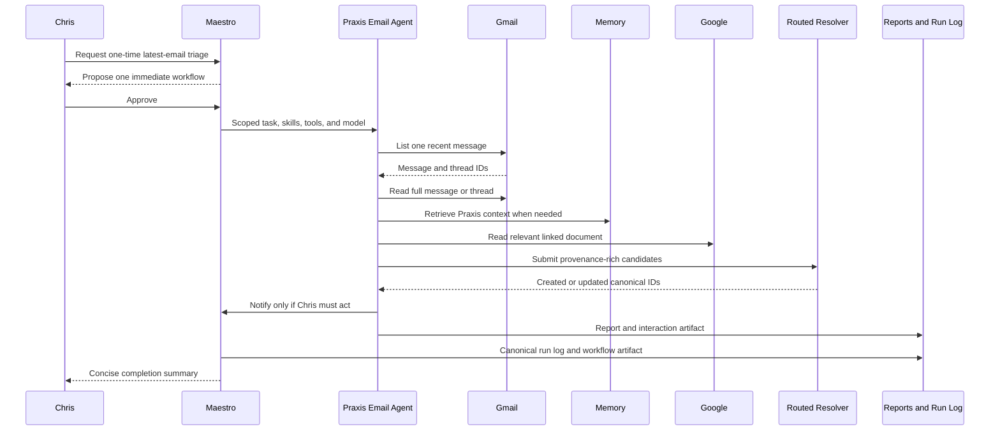

# Behavior Test 003: Single Praxis Email Triage

## Purpose

Prove that one manually selected Praxis email can travel through the complete triage path before
the same behavior is attached to an inbox trigger. The test covers retrieval, scoped memory,
classification, linked Google content, routed-object resolution, selective notification, reporting,
run logging, and memory curation.

## Behavioral Contract

For exactly one email, the Praxis Email Agent must:

1. Read message metadata and the full body or thread.
2. Retrieve Praxis-scoped memory when business context is needed for interpretation.
3. Classify the message as `spam_noise`, `response_needed`, `useful_info`, or `action_required`,
   with confidence and evidence.
4. Read a relevant linked Google Doc when the task permits it and preserve the link as provenance.
5. Send contacts, organizations, events, and Chris-owned todos through `routed.item.create`.
   The routed-memory resolver, not the agent, owns canonical dedupe and update behavior.
6. Use `workflow.notification.create` only when Chris must respond or decide, a material deadline
   exists, or the email exposes meaningful risk.
7. Produce a report, run-log entry, and provenance-rich interaction artifact for memory curation.

Agent execution steps such as "triage the email" or "record the contact" must never become
Chris-owned todos.

## Controlled Email

Send this message to the Praxis inbox from an account that is not already represented by a contact.
Replace the Google Doc placeholder with a Praxis-accessible document when testing linked content.

**Subject:** `Maestro triage test - Atlas partner sync`

```text
Hi Chris,

I'm Jordan Lee, the partnerships director at Atlas Systems. Please confirm by Tuesday, July 21,
2026 whether Praxis can support a 30-minute partner planning call on Wednesday, July 22 at 2:00 PM
Eastern. Morgan Reed from Atlas will also attend.

Before the call, please review the meeting notes and bring a recommendation on the pilot scope:
GOOGLE_DOC_URL

Thanks,
Jordan
jordan@example.com
```

## Primary Human Test

Send Maestro:

> Run a one-time Praxis email triage workflow over exactly the latest inbox message. Use the Praxis
> Email Agent to read the full email, retrieve relevant Praxis memory, classify it, inspect any
> relevant linked Google Doc, route canonical contacts, organizations, events, and only real
> Chris-owned todos, notify me if I must respond or act, and produce the report, run log, and memory
> artifact. This is an immediate test, not a recurring or triggered workflow.

## Test Matrix

| Step | Expected behavior | Evidence |
| --- | --- | --- |
| 3.1 Plan | Maestro proposes one immediate Praxis work item assigned to the Praxis Email Agent. It is not recurring and does not fan the same email out to unrelated agents. | Workflow preview: agent, tools, skills, model tier. |
| 3.2 Retrieve | The agent calls `gmail.message.list_recent` with limit 1, then `gmail.message.get` or `gmail.thread.get` for that message. | Tool trace contains one message ID and full body evidence. |
| 3.3 Ground | The agent uses existing Praxis memory context or calls `memory.context_bundle` before making business-specific claims. | Prompt/tool trace shows Praxis-scoped context and no cross-domain leakage. |
| 3.4 Enrich | If the controlled email contains an accessible Google Doc link, the agent calls `google.docs.get` and includes useful document content in the report. | Google tool result, file ID/link, and report section. |
| 3.5 Classify | Classification is `response_needed` or `action_required`, with confidence and evidence tied to the request and deadline. | Report classification section. |
| 3.6 Route | Jordan and Morgan become contacts, Atlas Systems becomes an organization, the call becomes an event, and Chris's confirmation/review obligation becomes a todo. | Routed-item tool output and canonical UI records. |
| 3.7 Resolve | Reprocessing the same message does not create duplicate canonical records. Provenance records the repeated observation/update. | Stable canonical IDs after a second run. |
| 3.8 Notify | One email-attention notification appears in Maestro chat explaining what Chris must do and by when. It links to the workflow/email provenance. | Chat notification and run-log notification ID. |
| 3.9 Report | The report names the email, classification, routed objects, notification decision, Google evidence, and recommended next action. | Reports tab. |
| 3.10 Remember | A canonical workflow artifact is staged and processed into durable memory with Gmail and Google provenance. | Memory Manager artifact and resulting memory source references. |
| 3.11 Complete | The workflow leaves Active, creates one completed run-log entry, and Maestro gives a concise conversational completion message. | Workflows tab, Run Log, and main chat. |

## Negative Controls

Run these only after the primary email passes:

| Email class | Expected behavior |
| --- | --- |
| Useful newsletter or informational update | Report and memory may be created; no Chris todo and no email-attention notification. |
| Obvious spam/noise | No routed objects or durable business memory. Mark-read remains approval-gated if requested. |
| Existing contact and organization | Resolver updates the canonical records and interaction history instead of creating duplicates. |
| Ambiguous date, person, or organization | Agent creates an actionable RFI or reports uncertainty instead of inventing fields. |

## Pass Criteria

- Every created object traces back to the Gmail message and any supporting Google file.
- The routed resolver creates or updates canonical objects without duplicates.
- Notifications are selective and actionable, not generic workflow-completion noise.
- The report and memory artifact preserve enough evidence for later agents to reuse the result.
- Reprocessing is idempotent at the canonical-object and notification layers.

## Execution Trace



## Run Notes

Append one dated entry per attempt with the Gmail message ID, workflow/run ID, classification,
routed canonical IDs, notification ID or reason for silence, report ID, artifact ID, observed
failures, and follow-up patch.

### 2026-07-19 - Attempt 1

- Workflow run: `3d0f541b-64f7-4c5f-8431-8b314b404f17`
- Selected message: `19f7b3e9bf208655`, thread `19f7120f92d15684`
- Report: `080880c3-0b65-41b8-afb4-976d337d2809`
- Result: failed behavioral contract despite terminal workflow status `completed`.
- The run started before PR #98 was merged, so the agent did not have
  `workflow.notification.create`. Silence was nevertheless defensible because the explicit email
  due-outs belonged to Chris Flournoy, William, or the group rather than clearly to Chris Aliperti.
- The tool planner passed `count: 1`, which the Gmail adapter ignored, and attempted placeholder IDs
  `<latest_message_id>` and `<linked_doc_id>`. It eventually fetched the correct full message but
  exhausted its two tool iterations before routing or linked-Doc retrieval.
- The final report invented a Chris-owned July 20 todo and treated a past July 17 meeting as a new
  event. It described candidates in prose without executing `routed.item.create`.
- Two artifacts were staged but not curated because no background dropbox worker was running. The
  canonical workflow artifact also defaulted to Maestro Development instead of the queue item's
  Praxis domain.
- Follow-up: dependency-aware email tool sequencing, four scheduler tool iterations, automatic
  memory-dropbox processing, stricter no-invention instructions, and queue-domain artifact routing.
