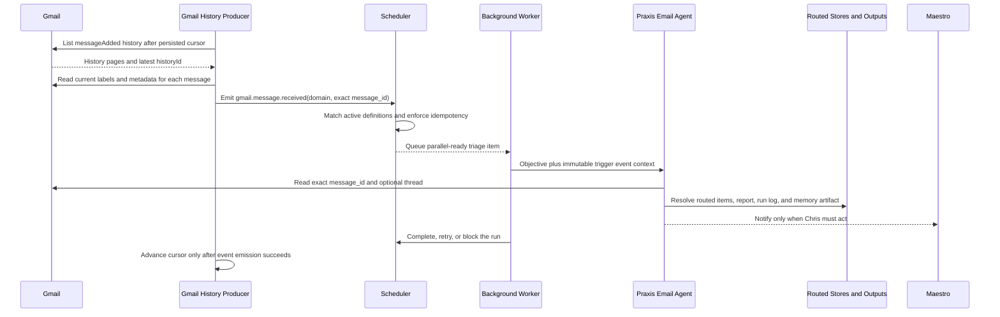

# Behavior Test 004: Durable Praxis Email Triage

## Purpose

Prove that each new eligible Praxis inbox message autonomously launches the already-hardened
single-email triage behavior exactly once, without requiring Maestro chat or blocking unrelated
work.

## Preconditions

- Behavior Test 003 passes for one manually selected email.
- The Praxis Google OAuth refresh token includes Gmail read/modify scopes and the Drive scope.
- The canonical `praxis-email-triage` template has been installed paused, reviewed, then activated.
- Gmail watch and the scheduler auto worker are enabled in Workflows.
- The Praxis Gmail monitor shows `healthy` after its initial cursor bootstrap.

## Test Matrix

| ID | Action | Expected behavior | Evidence | Status |
| --- | --- | --- | --- | --- |
| 4.0 | Install the canonical template paused, inspect its readiness, then activate it. | Installation creates one inactive Luna workflow with the Praxis Email Agent, five manager skills, exact-message objective, and three attempts. Activation is unavailable until prerequisites pass. | Workflows template and trigger cards. | Automated; human activation not run |
| 4.1 | Enable Gmail watch for the first time. | Maestro stores the current Gmail cursor and does not process old inbox messages. | Praxis Gmail monitor says `initialized`; zero new runs. | Not run |
| 4.2 | Send one controlled action-required email to Praxis. | One event and one queued run are created with that exact Gmail message ID. | Workflow event payload and run input. | Not run |
| 4.3 | Leave Maestro chat open while triage runs. | Chat remains usable; the workflow runs in the background. | A separate chat response can complete during triage. | Not run |
| 4.4 | Inspect the resulting run. | Luna reads the exact trigger message, routes canonical objects, and writes report/run-log/memory outputs. | Tool trace and output IDs. | Not run |
| 4.5 | Let an action-required run complete. | One conversational notification tells Chris what he owes and by when. | Primary Maestro channel notification. | Not run |
| 4.6 | Send a useful but non-actionable email. | Triage and durable outputs complete quietly, with no Chris todo or attention notification. | Run log plus absence of notification. | Not run |
| 4.7 | Re-poll the same Gmail history page or restart the backend. | No duplicate workflow run or routed canonical object is created. | Stable run and canonical IDs. | Not run |
| 4.8 | Send two messages close together. | Both exact-message runs queue independently and may execute in parallel within scheduler limits. | Two event IDs and two runs. | Not run |
| 4.9 | Force a transient run failure. | Queue retries up to its configured limit, then exposes a replayable failure if exhausted. | Attempts, scheduler events, and Needs Attention. | Not run |
| 4.10 | Replay a failed run. | The new run retains the original Gmail message ID instead of reading the latest inbox message. | Replay run input payload. | Not run |
| 4.11 | Force Gmail polling to fail three times. | Trigger health becomes `error` and Maestro posts one actionable channel warning. | Gmail monitor, notification, and chat. | Not run |
| 4.12 | Reset the Gmail cursor. | Monitoring resumes at the current mailbox state without back-processing the missed interval. | Cursor-reset warning and no historical runs. | Not run |

## Pass Criteria

- One eligible incoming Gmail message produces no more than one canonical workflow run.
- Every run is pinned to the triggering message ID; `latest email` is never resolved at execution
  time.
- Initial enablement, restarts, retries, replay, and cursor recovery are deterministic.
- Quiet mail stays quiet; Chris-action mail produces one useful conversational notification.
- Trigger polling and workflow execution remain observable and do not block Maestro chat.

## Execution Trace

