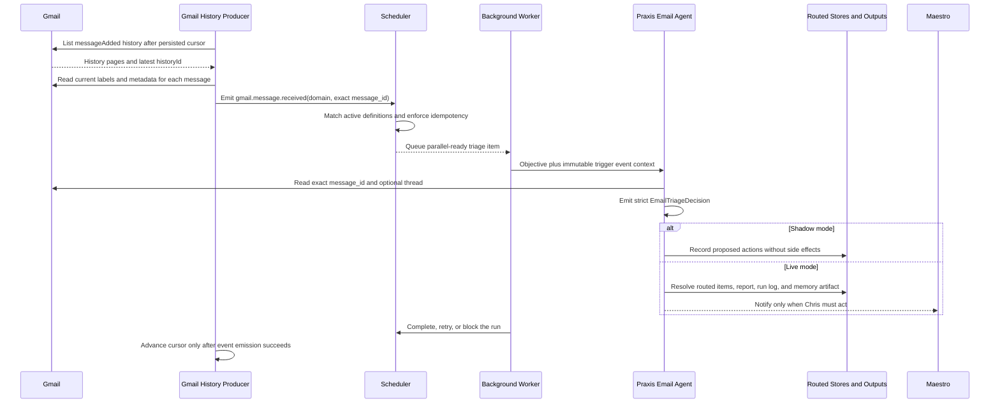

# Behavior Test 004: Durable Praxis Email Triage

## Purpose

Prove that each new eligible Praxis inbox message autonomously launches the already-hardened
single-email triage behavior exactly once, without requiring Maestro chat or blocking unrelated
work.

## Preconditions

- Behavior Test 003 passes for one manually selected email.
- The Praxis Google OAuth refresh token includes Gmail read/modify scopes and the Drive scope.
- The canonical `praxis-email-triage` template has been installed paused, reviewed, then activated.
- Keep the workflow in shadow mode for Tests 4.1 through 4.4; switch to live only after its typed
  decisions match the source emails.
- Gmail watch and the scheduler auto worker are enabled in Workflows.
- The Praxis Gmail monitor shows `healthy` after its initial cursor bootstrap.

## Test Matrix

| ID | Action | Expected behavior | Evidence | Status |
| --- | --- | --- | --- | --- |
| 4.0 | Install the canonical template paused, inspect its readiness, then activate it. | Installation creates one inactive Luna workflow with the Praxis Email Agent, five manager skills, exact-message objective, and three attempts. Activation is unavailable until prerequisites pass. | Workflows template and trigger cards. | Automated; human activation not run |
| 4.0a | Inspect the installed trigger card. | Shadow mode is on by default and can be toggled independently of workflow activation and Gmail watch. | Trigger card and definition `workflow_spec.shadow_mode`. | Automated; human UI not run |
| 4.1 | Enable Gmail watch on the active Praxis Email Triage card for the first time. | Maestro stores the current Gmail cursor and does not process old inbox messages. | Workflow card says the account monitor is `initialized`; zero new runs. | Not run |
| 4.2 | Send one controlled action-required email to Praxis. | One event and one queued run are created with that exact Gmail message ID. | Workflow event payload and run input. | Not run |
| 4.3 | Leave Maestro chat open while triage runs. | Chat remains usable; the workflow runs in the background. | A separate chat response can complete during triage. | Not run |
| 4.4 | Inspect the resulting shadow run. | Luna reads the exact trigger message and records one strict decision. The run shows classification/confidence, notification judgment, routed candidates, linked-document outcomes, read action, and `shadow run`; no routed object, notification, or Gmail mutation is executed. | Agent-run decision card and tool trace. | Automated; human trigger not run |
| 4.4a | Switch the durable workflow to live mode and replay the controlled email. | The same decision is converted to constrained writes. Replaying the same source cannot duplicate routed staging or canonical records. | Live-run decision card, routed IDs, notification ID, and Gmail mutation. | Idempotency automated; human live run not run |
| 4.5 | Let an action-required run complete. | One conversational notification tells Chris what he owes and by when. | Primary Maestro channel notification. | Not run |
| 4.6 | Send a useful but non-actionable email. | Triage and durable outputs complete quietly, with no Chris todo or attention notification. | Run log plus absence of notification. | Not run |
| 4.7 | Re-poll the same Gmail history page or restart the backend. | No duplicate workflow run or routed canonical object is created. | Stable run and canonical IDs. | Not run |
| 4.8 | Send two messages close together. | Both exact-message runs queue independently and may execute in parallel within scheduler limits. | Two event IDs and two runs. | Not run |
| 4.9 | Force a transient run failure. | Queue retries up to its configured limit, then exposes a replayable failure if exhausted. | Attempts, scheduler events, and Needs Attention. | Not run |
| 4.10 | Replay a failed run. | The new run retains the original Gmail message ID instead of reading the latest inbox message. | Replay run input payload. | Not run |
| 4.11 | Force Gmail polling to fail three times. | Trigger health becomes `error` and Maestro posts one actionable channel warning. | Gmail monitor, notification, and chat. | Not run |
| 4.12 | Reset the Gmail cursor. | Monitoring resumes at the current mailbox state without back-processing the missed interval. | Cursor-reset warning and no historical runs. | Not run |
| 4.13 | Let triage classify an email as noise and request only marking it read. | The agent removes only `UNREAD` without approval and completes the run. Other Gmail label mutations remain approval-gated. | Gmail tool trace and completed workflow run. | Automated; human trigger not run |
| 4.14 | Force an approval-gated Gmail mutation such as archive. | Needs Attention and the main chat name the exact action and rationale. Approval completes the same blocked durable run rather than creating a new workflow. | Approval card, channel message, and original run ID. | Automated; human trigger not run |
| 4.15 | Send an email containing two relevant Google Docs. | Each unique file is read once. The final decision records `read`, `inaccessible`, `not_read`, or `irrelevant` for each discovered linked artifact and never invents inaccessible content. | Google tool calls and `linked_documents` decision entries. | Automated link sequencing; human OAuth run not run |
| 4.16 | Retry the same operational decision after an interrupted write. | Same-message routed candidates and notifications remain singletons; the run reports duplicate resolution instead of creating copies. | `duplicate_count`, stable source-linked IDs, and run log. | Automated |

## Pass Criteria

- One eligible incoming Gmail message produces no more than one canonical workflow run.
- Every run is pinned to the triggering message ID; `latest email` is never resolved at execution
  time.
- Initial enablement, restarts, retries, replay, and cursor recovery are deterministic.
- Quiet mail stays quiet; Chris-action mail produces one useful conversational notification.
- Trigger polling and workflow execution remain observable and do not block Maestro chat.

## Execution Trace

```mermaid
sequenceDiagram
    participant Gmail
    participant Trigger as Gmail History Producer
    participant Scheduler
    participant Worker as Background Worker
    participant Agent as Praxis Email Agent
    participant Outputs as Routed Stores and Outputs
    participant Maestro

    Trigger->>Gmail: List messageAdded history after persisted cursor
    Gmail-->>Trigger: History pages and latest historyId
    Trigger->>Gmail: Read current labels and metadata for each message
    Trigger->>Scheduler: Emit gmail.message.received(domain, exact message_id)
    Scheduler->>Scheduler: Match active definitions and enforce idempotency
    Scheduler-->>Worker: Queue parallel-ready triage item
    Worker->>Agent: Objective plus immutable trigger event context
    Agent->>Gmail: Read exact message_id and optional thread
    Agent->>Agent: Emit strict EmailTriageDecision
    alt Shadow mode
        Agent->>Outputs: Record proposed actions without side effects
    else Live mode
        Agent->>Outputs: Resolve routed items, report, run log, and memory artifact
        Agent-->>Maestro: Notify only when Chris must act
    end
    Worker->>Scheduler: Complete, retry, or block the run
    Trigger->>Trigger: Advance cursor only after event emission succeeds
```

## Human Validation Set

Use controlled messages with unique subjects so each source is easy to audit:

1. **Action required:** a new sender asks Chris for a response by a date. Expect a contact, optional
   organization, Chris-owned todo, and one notification.
2. **Quiet information:** a known partner sends a useful update with no request. Expect useful
   context and interaction provenance but no notification or Chris todo.
3. **Calendar invitation:** a future meeting names attendees and Eastern time. Expect one event and
   attendee contact resolution; no duplicate when replayed.
4. **Noise:** an irrelevant solicitation contains no durable business object. Expect no routed
   writes; live mode may remove only `UNREAD`.
5. **Linked content:** an email links one shared Google Doc and one unshared file. Expect grounded
   summary from the shared file and an explicit `inaccessible` entry for the other.
6. **Burst:** send two emails before the next poll. Expect two immutable event/run IDs and neither
   message to be dropped or overwritten.
